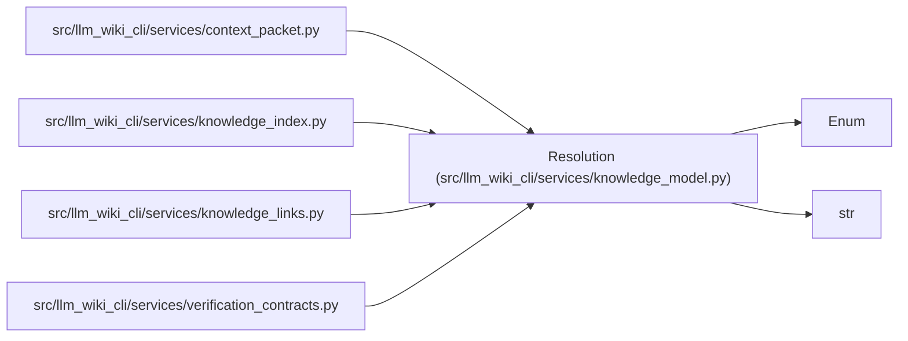

# Resolution

**Location:** `src/llm_wiki_cli/services/knowledge_model.py:133`
**Kind:** Enum
**Bases:** `str`, `Enum`
**Module:** [knowledge_model](../modules/knowledge_model.md)

## Description

_Auto-generated from `Resolution` in `src/llm_wiki_cli/services/knowledge_model.py`._

## Attributes

| Name | Declared value | Description |
|------|-------|-------------|
| `RESOLVED` | `'resolved'` | — |
| `AMBIGUOUS` | `'ambiguous'` | — |
| `EXTERNAL` | `'external'` | — |
| `UNRESOLVED` | `'unresolved'` | — |

## Methods

*No public methods. Inherits from base classes.*

## Relationships

<!-- Auto-generated relationship summary. Do not edit by hand. -->

### Summary

| Module | Methods | Attributes |
|---|---:|---|
| [knowledge_model](../modules/knowledge_model.md) | 0 | `AMBIGUOUS`, `EXTERNAL`, `RESOLVED`, `UNRESOLVED` |

### Structure

| Kind | Entity | Module |
|---|---|---|
| Base | `Enum` | — |
| Base | `str` | — |

### References

| Reference | Kind | Source |
|---|---|---|
| `context_packet` | import | [context_packet](../modules/context_packet.md) |
| `knowledge_index` | import | [knowledge_index](../modules/knowledge_index.md) |
| `knowledge_links` | import | [knowledge_links](../modules/knowledge_links.md) |
| `verification_contracts` | import | [verification_contracts](../modules/verification_contracts.md) |
