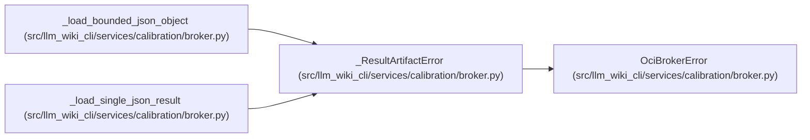

# _ResultArtifactError

**Location:** `src/llm_wiki_cli/services/calibration/broker.py:2571`
**Kind:** Class
**Bases:** `OciBrokerError`
**Module:** [broker](../modules/broker.md)

## Description

_Auto-generated from `_ResultArtifactError` in `src/llm_wiki_cli/services/calibration/broker.py`._

## Attributes

*No annotated attributes found.*

## Methods

| Method | Signature | Decorators | Description |
|--------|-----------|------------|-------------|
| `__init__` | `(status: str, message: str) -> None` | — | — |

## Relationships

<!-- Auto-generated relationship summary. Do not edit by hand. -->

### Summary

| Module | Methods | Attributes |
|---|---:|---|
| [broker](../modules/broker.md) | 1 | — |

### Structure

| Kind | Entity | Module |
|---|---|---|
| Base | `OciBrokerError` | [broker](../modules/broker.md) |

### References

| Reference | Kind | Source | Call sites |
|---|---|---|---:|
| `_load_bounded_json_object` | call | [broker](../modules/broker.md) | 1 |
| `_load_single_json_result` | call | [broker](../modules/broker.md) | 8 |
