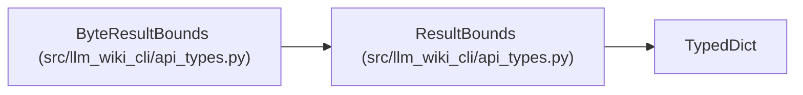

# ResultBounds

**Location:** `src/llm_wiki_cli/api_types.py:17`
**Kind:** Class
**Bases:** `TypedDict`
**Module:** [api_types](../modules/api_types.md)

## Description

Exact size disclosure for one bounded result collection.

## Attributes

| Name | Type | Default | Description |
|------|------|---------|-------------|
| `total` | `int` | *required* | — |
| `returned` | `int` | *required* | — |
| `truncated` | `bool` | *required* | — |

## Methods

*No public methods. Inherits from base classes.*

## Relationships

<!-- Auto-generated relationship summary. Do not edit by hand. -->

### Summary

| Module | Methods | Attributes |
|---|---:|---|
| [api_types](../modules/api_types.md) | 0 | `returned`, `total`, `truncated` |

### Structure

| Kind | Entity | Module |
|---|---|---|
| Base | `TypedDict` | — |
| Subclass | `ByteResultBounds` | [api_types](../modules/api_types.md) |
