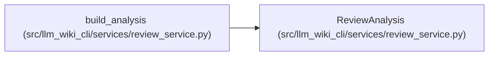

# ReviewAnalysis

**Location:** `src/llm_wiki_cli/services/review_service.py:89`
**Kind:** Class
**Bases:** —
**Module:** [review_service](../modules/review_service.md)

**Decorators:** `@dataclass`

## Description

_Auto-generated from `ReviewAnalysis` in `src/llm_wiki_cli/services/review_service.py`._

## Attributes

| Name | Type | Default | Description |
|------|------|---------|-------------|
| `findings` | `list[ReviewFinding]` | *required* | — |
| `changes` | `dict` | *required* | — |
| `page_mapping` | `dict[str, list[str]]` | *required* | — |
| `inventory` | `dict` | *required* | — |
| `source_snapshot` | `SourceSnapshot` | *required* | — |

## Methods

*No public methods. Inherits from base classes.*

## Relationships

<!-- Auto-generated relationship summary. Do not edit by hand. -->

### Summary

| Module | Methods | Attributes |
|---|---:|---|
| [review_service](../modules/review_service.md) | 0 | `changes`, `findings`, `inventory`, `page_mapping`, `source_snapshot` |

### References

| Reference | Kind | Source | Call sites |
|---|---|---|---:|
| `build_analysis` | call | [review_service](../modules/review_service.md) | 1 |
| `build_analysis` | type_reference | [review_service](../modules/review_service.md) | — |
