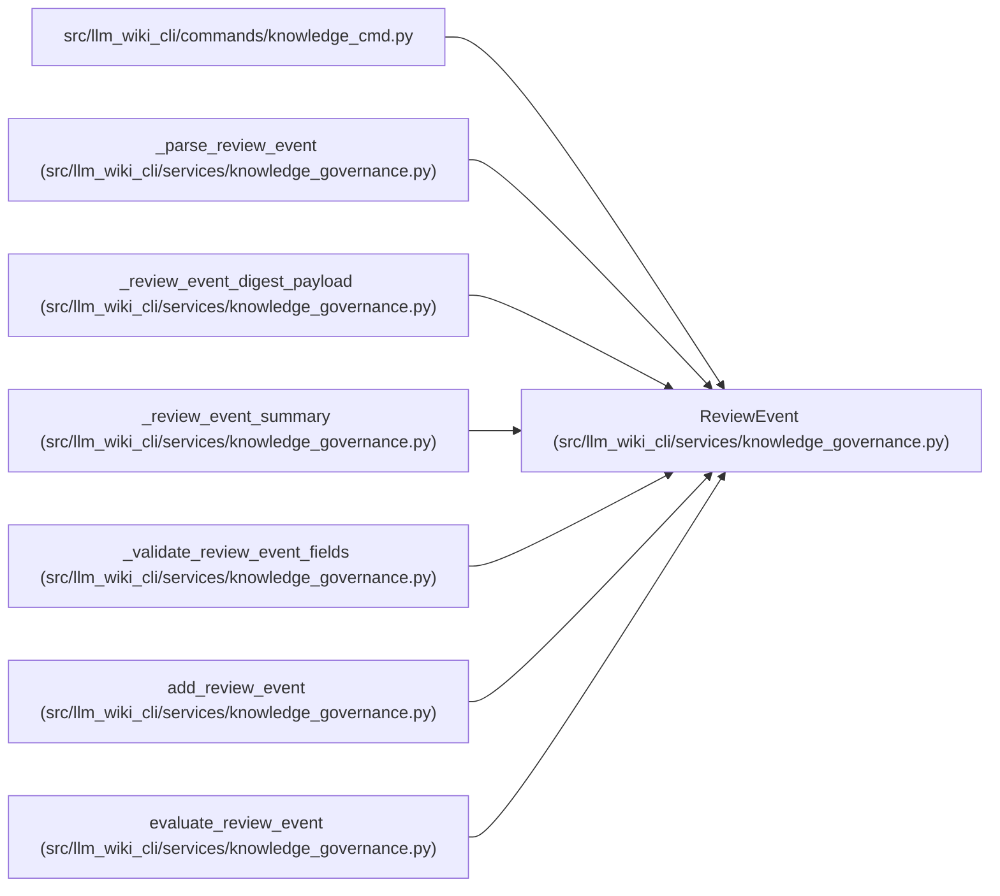

# ReviewEvent

**Location:** `src/llm_wiki_cli/services/knowledge_governance.py:238`
**Kind:** Class
**Bases:** —
**Module:** [knowledge_governance](../modules/knowledge_governance.md)

**Decorators:** `@dataclass(frozen=True)`

## Description

One section-scoped, digest-bound human review event.

## Attributes

| Name | Type | Default | Description |
|------|------|---------|-------------|
| `event_id` | `str` | *required* | — |
| `concept_uid` | `str` | *required* | — |
| `section_locator` | `str` | *required* | — |
| `scope_hash` | `str` | *required* | — |
| `evidence` | `ReviewEvidence` | *required* | — |
| `reviewer` | `GovernanceActor` | *required* | — |
| `method` | `str` | *required* | — |
| `method_version` | `str` | *required* | — |
| `authored_at` | `str` | *required* | — |

## Methods

| Method | Signature | Decorators | Description |
|--------|-----------|------------|-------------|
| `to_payload` | `() -> dict[str, object]` | — | — |

## Relationships

<!-- Auto-generated relationship summary. Do not edit by hand. -->

### Summary

| Module | Methods | Attributes |
|---|---:|---|
| [knowledge_governance](../modules/knowledge_governance.md) | 1 | `authored_at`, `concept_uid`, `event_id`, `evidence`, `method`, `method_version`, `reviewer`, `scope_hash`, `section_locator` |

### References

| Reference | Kind | Source | Call sites |
|---|---|---|---:|
| `knowledge_cmd` | import | [knowledge_cmd](../modules/knowledge_cmd.md) | — |
| `_parse_review_event` | call | [knowledge_governance](../modules/knowledge_governance.md) | 1 |
| `_parse_review_event` | type_reference | [knowledge_governance](../modules/knowledge_governance.md) | — |
| `_review_event_digest_payload` | type_reference | [knowledge_governance](../modules/knowledge_governance.md) | — |
| `_review_event_summary` | type_reference | [knowledge_governance](../modules/knowledge_governance.md) | — |
| `_validate_review_event_fields` | type_reference | [knowledge_governance](../modules/knowledge_governance.md) | — |
| `add_review_event` | call | [knowledge_governance](../modules/knowledge_governance.md) | 1 |
| `evaluate_review_event` | type_reference | [knowledge_governance](../modules/knowledge_governance.md) | — |
