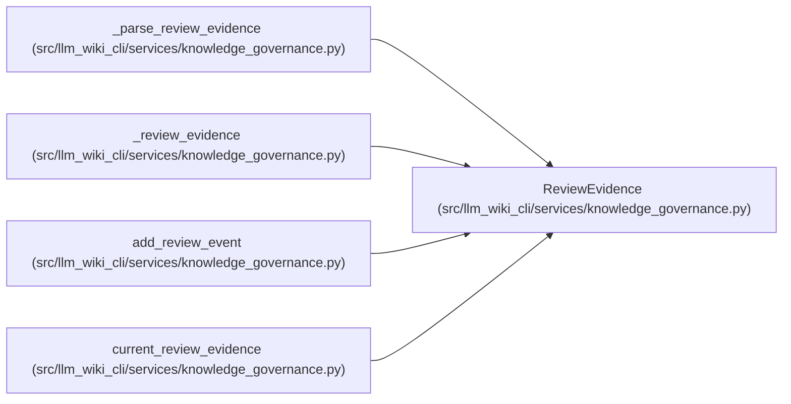

# ReviewEvidence

**Location:** `src/llm_wiki_cli/services/knowledge_governance.py:220`
**Kind:** Class
**Bases:** —
**Module:** [knowledge_governance](../modules/knowledge_governance.md)

**Decorators:** `@dataclass(frozen=True)`

## Description

The explicit evidence basis to which a review was authored.

## Attributes

| Name | Type | Default | Description |
|------|------|---------|-------------|
| `mode` | `str` | *required* | — |
| `basis_ids` | `tuple[str, ...]` | `()` | — |
| `basis_hashes` | `tuple[str, ...]` | `()` | — |

## Methods

| Method | Signature | Decorators | Description |
|--------|-----------|------------|-------------|
| `to_payload` | `() -> dict[str, object]` | — | — |

## Relationships

<!-- Auto-generated relationship summary. Do not edit by hand. -->

### Summary

| Module | Methods | Attributes |
|---|---:|---|
| [knowledge_governance](../modules/knowledge_governance.md) | 1 | `basis_hashes`, `basis_ids`, `mode` |

### References

| Reference | Kind | Source |
|---|---|---|
| `_parse_review_evidence` | call | [knowledge_governance](../modules/knowledge_governance.md) |
| `_parse_review_evidence` | call | [knowledge_governance](../modules/knowledge_governance.md) |
| `_parse_review_evidence` | type_reference | [knowledge_governance](../modules/knowledge_governance.md) |
| `_review_evidence` | call | [knowledge_governance](../modules/knowledge_governance.md) |
| `_review_evidence` | call | [knowledge_governance](../modules/knowledge_governance.md) |
| `_review_evidence` | type_reference | [knowledge_governance](../modules/knowledge_governance.md) |
| `add_review_event` | type_reference | [knowledge_governance](../modules/knowledge_governance.md) |
| `current_review_evidence` | call | [knowledge_governance](../modules/knowledge_governance.md) |
| `current_review_evidence` | call | [knowledge_governance](../modules/knowledge_governance.md) |
| `current_review_evidence` | call | [knowledge_governance](../modules/knowledge_governance.md) |
| `current_review_evidence` | type_reference | [knowledge_governance](../modules/knowledge_governance.md) |
