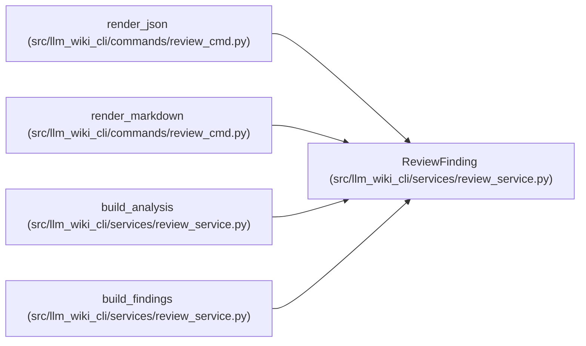

# ReviewFinding

**Location:** `src/llm_wiki_cli/services/review_service.py:80`
**Kind:** Class
**Bases:** —
**Module:** [review_service](../modules/review_service.md)

**Decorators:** `@dataclass`

## Description

_Auto-generated from `ReviewFinding` in `src/llm_wiki_cli/services/review_service.py`._

## Attributes

| Name | Type | Default | Description |
|------|------|---------|-------------|
| `severity` | `str` | *required* | — |
| `source_path` | `str` | *required* | — |
| `wiki_pages` | `list[str]` | *required* | — |
| `reason` | `str` | *required* | — |
| `suggested_follow_up` | `str` | *required* | — |

## Methods

*No public methods. Inherits from base classes.*

## Relationships

<!-- Auto-generated relationship summary. Do not edit by hand. -->

### Summary

| Module | Methods | Attributes |
|---|---:|---|
| [review_service](../modules/review_service.md) | 0 | `reason`, `severity`, `source_path`, `suggested_follow_up`, `wiki_pages` |

### References

| Reference | Kind | Source | Call sites |
|---|---|---|---:|
| `render_json` | type_reference | [review_cmd](../modules/review_cmd.md) | — |
| `render_markdown` | type_reference | [review_cmd](../modules/review_cmd.md) | — |
| `build_analysis` | call | [review_service](../modules/review_service.md) | 6 |
| `build_findings` | type_reference | [review_service](../modules/review_service.md) | — |
