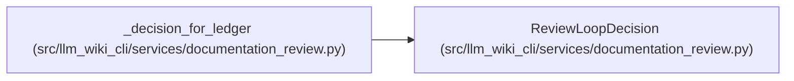

# ReviewLoopDecision

**Location:** `src/llm_wiki_cli/services/documentation_review.py:481`
**Kind:** Class
**Bases:** —
**Module:** [documentation_review](../modules/documentation_review.md)

**Decorators:** `@dataclass(frozen=True)`

## Description

Controller instruction returned without mutating lifecycle state.

## Attributes

| Name | Type | Default | Description |
|------|------|---------|-------------|
| `action` | `str` | *required* | — |
| `blocked` | `bool` | *required* | — |
| `can_continue` | `bool` | *required* | — |
| `requires_supervisor_reconciliation` | `bool` | *required* | — |
| `publish_ready` | `bool` | *required* | — |
| `finding_ids` | `tuple[str, ...]` | *required* | — |
| `rationale` | `str` | *required* | — |

## Methods

| Method | Signature | Decorators | Description |
|--------|-----------|------------|-------------|
| `to_dict` | `() -> dict[str, Any]` | — | — |

## Relationships

<!-- Auto-generated relationship summary. Do not edit by hand. -->

### Summary

| Module | Methods | Attributes |
|---|---:|---|
| [documentation_review](../modules/documentation_review.md) | 1 | `action`, `blocked`, `can_continue`, `finding_ids`, `publish_ready`, `rationale`, `requires_supervisor_reconciliation` |

### References

| Reference | Kind | Source | Call sites |
|---|---|---|---:|
| `_decision_for_ledger` | call | [documentation_review](../modules/documentation_review.md) | 5 |
| `_decision_for_ledger` | type_reference | [documentation_review](../modules/documentation_review.md) | — |
