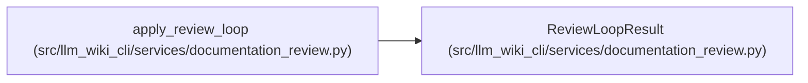

# ReviewLoopResult

**Location:** `src/llm_wiki_cli/services/documentation_review.py:507`
**Kind:** Class
**Bases:** —
**Module:** [documentation_review](../modules/documentation_review.md)

**Decorators:** `@dataclass(frozen=True)`

## Description

_Auto-generated from `ReviewLoopResult` in `src/llm_wiki_cli/services/documentation_review.py`._

## Attributes

| Name | Type | Default | Description |
|------|------|---------|-------------|
| `ledger` | `DocumentationReviewLedger` | *required* | — |
| `decision` | `ReviewLoopDecision` | *required* | — |

## Methods

| Method | Signature | Decorators | Description |
|--------|-----------|------------|-------------|
| `to_dict` | `() -> dict[str, Any]` | — | — |

## Relationships

<!-- Auto-generated relationship summary. Do not edit by hand. -->

### Summary

| Module | Methods | Attributes |
|---|---:|---|
| [documentation_review](../modules/documentation_review.md) | 1 | `decision`, `ledger` |

### References

| Reference | Kind | Source | Call sites |
|---|---|---|---:|
| `apply_review_loop` | call | [documentation_review](../modules/documentation_review.md) | 4 |
| `apply_review_loop` | type_reference | [documentation_review](../modules/documentation_review.md) | — |
