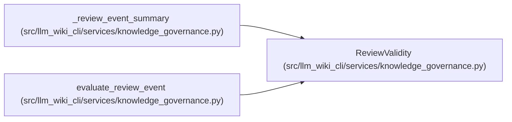

# ReviewValidity

**Location:** `src/llm_wiki_cli/services/knowledge_governance.py:346`
**Kind:** Class
**Bases:** —
**Module:** [knowledge_governance](../modules/knowledge_governance.md)

**Decorators:** `@dataclass(frozen=True)`

## Description

Computed review validity; this is never persisted in the ledger.

## Attributes

| Name | Type | Default | Description |
|------|------|---------|-------------|
| `event_id` | `str` | *required* | — |
| `valid` | `bool` | *required* | — |
| `reasons` | `tuple[str, ...]` | *required* | — |

## Methods

| Method | Signature | Decorators | Description |
|--------|-----------|------------|-------------|
| `state` | `() -> str` | `@property` | — |

## Relationships

<!-- Auto-generated relationship summary. Do not edit by hand. -->

### Summary

| Module | Methods | Attributes |
|---|---:|---|
| [knowledge_governance](../modules/knowledge_governance.md) | 1 | `event_id`, `reasons`, `valid` |

### References

| Reference | Kind | Source |
|---|---|---|
| `_review_event_summary` | type_reference | [knowledge_governance](../modules/knowledge_governance.md) |
| `evaluate_review_event` | call | [knowledge_governance](../modules/knowledge_governance.md) |
| `evaluate_review_event` | type_reference | [knowledge_governance](../modules/knowledge_governance.md) |
