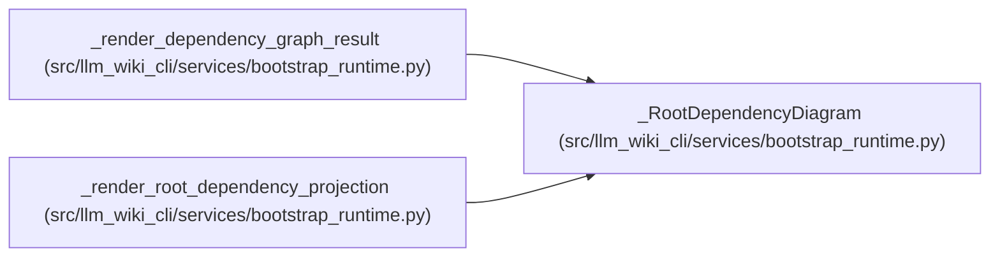

# _RootDependencyDiagram

**Location:** `src/llm_wiki_cli/services/bootstrap_runtime.py:2827`
**Kind:** Class
**Bases:** —
**Module:** [bootstrap_runtime](../modules/bootstrap_runtime.md)

**Decorators:** `@dataclass(frozen=True)`

## Description

_Auto-generated from `_RootDependencyDiagram` in `src/llm_wiki_cli/services/bootstrap_runtime.py`._

## Attributes

| Name | Type | Default | Description |
|------|------|---------|-------------|
| `diagram` | `str \| None` | *required* | — |
| `rendered_detail` | `str` | *required* | — |
| `total_edges` | `int` | *required* | — |
| `shown_edges` | `int` | *required* | — |
| `omitted_edges` | `int` | *required* | — |
| `node_count` | `int` | *required* | — |

## Methods

*No public methods. Inherits from base classes.*

## Relationships

<!-- Auto-generated relationship summary. Do not edit by hand. -->

### Summary

| Module | Methods | Attributes |
|---|---:|---|
| [bootstrap_runtime](../modules/bootstrap_runtime.md) | 0 | `diagram`, `node_count`, `omitted_edges`, `rendered_detail`, `shown_edges`, `total_edges` |

### References

| Reference | Kind | Source |
|---|---|---|
| `_render_dependency_graph_result` | call | [bootstrap_runtime](../modules/bootstrap_runtime.md) |
| `_render_dependency_graph_result` | call | [bootstrap_runtime](../modules/bootstrap_runtime.md) |
| `_render_dependency_graph_result` | type_reference | [bootstrap_runtime](../modules/bootstrap_runtime.md) |
| `_render_root_dependency_projection` | call | [bootstrap_runtime](../modules/bootstrap_runtime.md) |
| `_render_root_dependency_projection` | call | [bootstrap_runtime](../modules/bootstrap_runtime.md) |
| `_render_root_dependency_projection` | call | [bootstrap_runtime](../modules/bootstrap_runtime.md) |
| `_render_root_dependency_projection` | type_reference | [bootstrap_runtime](../modules/bootstrap_runtime.md) |
