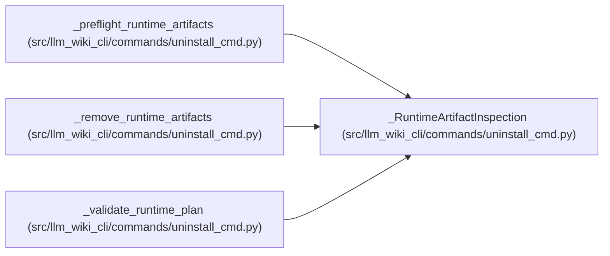

# _RuntimeArtifactInspection

**Location:** `src/llm_wiki_cli/commands/uninstall_cmd.py:83`
**Kind:** Class
**Bases:** —
**Module:** [uninstall_cmd](../modules/uninstall_cmd.md)

**Decorators:** `@dataclass(frozen=True)`

## Description

One runtime path classified without following unsafe entries.

## Attributes

| Name | Type | Default | Description |
|------|------|---------|-------------|
| `path` | `Path` | *required* | — |
| `removable` | `bool` | *required* | — |
| `reason` | `str \| None` | `None` | — |
| `digest` | `str \| None` | `None` | — |
| `content` | `bytes \| None` | `None` | — |

## Methods

*No public methods. Inherits from base classes.*

## Relationships

<!-- Auto-generated relationship summary. Do not edit by hand. -->

### Summary

| Module | Methods | Attributes |
|---|---:|---|
| [uninstall_cmd](../modules/uninstall_cmd.md) | 0 | `content`, `digest`, `path`, `reason`, `removable` |

### References

| Reference | Kind | Source | Call sites |
|---|---|---|---:|
| `_preflight_runtime_artifacts` | call | [uninstall_cmd](../modules/uninstall_cmd.md) | 5 |
| `_preflight_runtime_artifacts` | type_reference | [uninstall_cmd](../modules/uninstall_cmd.md) | — |
| `_remove_runtime_artifacts` | type_reference | [uninstall_cmd](../modules/uninstall_cmd.md) | — |
| `_validate_runtime_plan` | type_reference | [uninstall_cmd](../modules/uninstall_cmd.md) | — |
