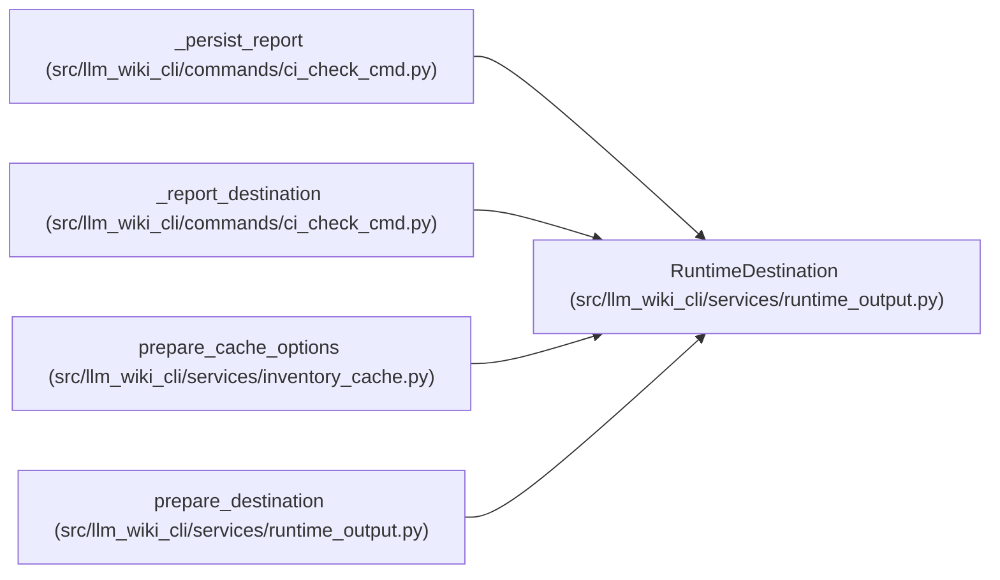

# RuntimeDestination

**Location:** `src/llm_wiki_cli/services/runtime_output.py:37`
**Kind:** Class
**Bases:** —
**Module:** [runtime_output](../modules/runtime_output.md)

**Decorators:** `@dataclass`

## Description

_Auto-generated from `RuntimeDestination` in `src/llm_wiki_cli/services/runtime_output.py`._

## Attributes

| Name | Type | Default | Description |
|------|------|---------|-------------|
| `path` | `Path \| None` | *required* | — |
| `explicit` | `bool` | `False` | — |
| `status` | `str` | `'disabled'` | — |
| `error` | `str \| None` | `None` | — |

## Methods

| Method | Signature | Decorators | Description |
|--------|-----------|------------|-------------|
| `to_payload` | `() -> dict[str, object]` | — | — |

## Relationships

<!-- Auto-generated relationship summary. Do not edit by hand. -->

### Summary

| Module | Methods | Attributes |
|---|---:|---|
| [runtime_output](../modules/runtime_output.md) | 1 | `error`, `explicit`, `path`, `status` |

### References

| Reference | Kind | Source | Call sites |
|---|---|---|---:|
| `_persist_report` | type_reference | [ci_check_cmd](../modules/ci_check_cmd.md) | — |
| `_report_destination` | call | [ci_check_cmd](../modules/ci_check_cmd.md) | 1 |
| `_report_destination` | type_reference | [ci_check_cmd](../modules/ci_check_cmd.md) | — |
| `prepare_cache_options` | call | [inventory_cache](../modules/inventory_cache.md) | 1 |
| `prepare_destination` | call | [runtime_output](../modules/runtime_output.md) | 2 |
| `prepare_destination` | type_reference | [runtime_output](../modules/runtime_output.md) | — |
