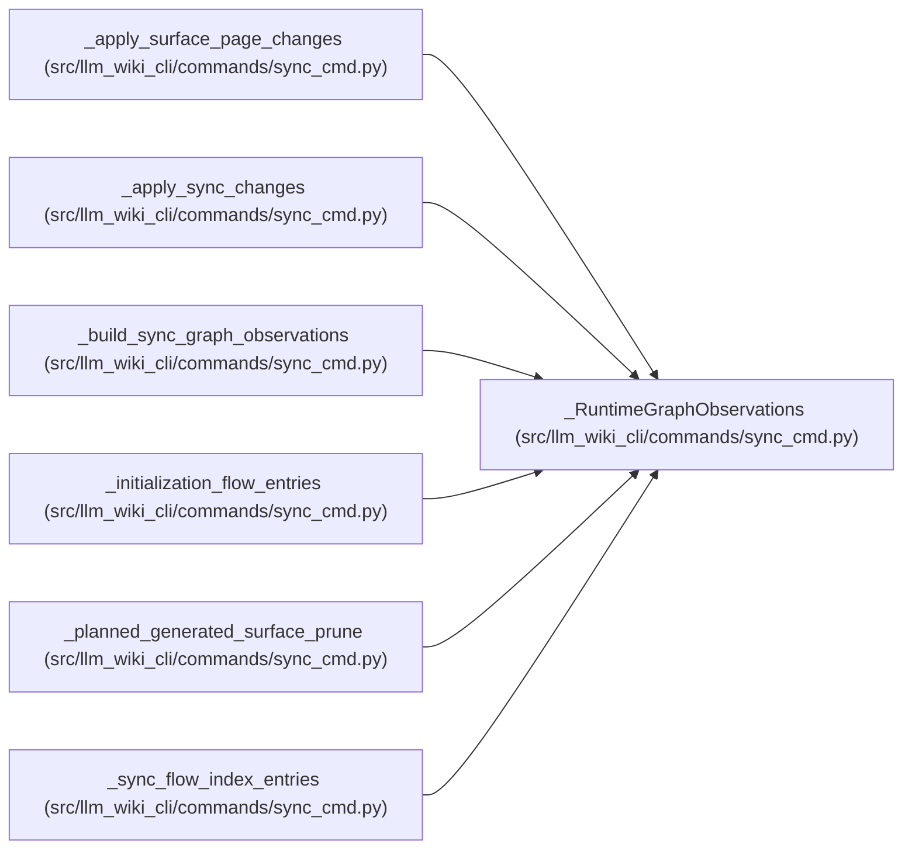

# _RuntimeGraphObservations

**Location:** `src/llm_wiki_cli/commands/sync_cmd.py:1624`
**Kind:** Class
**Bases:** —
**Module:** [sync_cmd](../modules/sync_cmd.md)

**Decorators:** `@dataclass(frozen=True)`

## Description

_Auto-generated from `_RuntimeGraphObservations` in `src/llm_wiki_cli/commands/sync_cmd.py`._

## Attributes

| Name | Type | Default | Description |
|------|------|---------|-------------|
| `resolved_call_edges` | `list[dict]` | *required* | — |
| `call_observations` | `dict` | *required* | — |
| `dependency_observations` | `dict` | *required* | — |
| `entrypoint_observations` | `dict` | *required* | — |
| `surface_flow_entries` | `list[dict]` | *required* | — |
| `flows` | `list[dict]` | *required* | — |
| `rendering_flows` | `list[dict]` | *required* | — |
| `data_flows` | `list[dict]` | *required* | — |
| `rendering_data_flows` | `list[dict]` | *required* | — |
| `external_dependencies` | `list[dict]` | *required* | — |
| `dependency_analysis` | `dict \| None` | *required* | — |
| `analyzer_limitations` | `dict[str, tuple[str, ...]]` | `field(default_factory=dict)` | — |

## Methods

*No public methods. Inherits from base classes.*

## Relationships

<!-- Auto-generated relationship summary. Do not edit by hand. -->

### Summary

| Module | Methods | Attributes |
|---|---:|---|
| [sync_cmd](../modules/sync_cmd.md) | 0 | `analyzer_limitations`, `call_observations`, `data_flows`, `dependency_analysis`, `dependency_observations`, `entrypoint_observations`, `external_dependencies`, `flows`, `rendering_data_flows`, `rendering_flows`, `resolved_call_edges`, `surface_flow_entries` |

### References

| Reference | Kind | Source | Call sites |
|---|---|---|---:|
| `_apply_surface_page_changes` | type_reference | [sync_cmd](../modules/sync_cmd.md) | — |
| `_apply_sync_changes` | type_reference | [sync_cmd](../modules/sync_cmd.md) | — |
| `_build_sync_graph_observations` | call | [sync_cmd](../modules/sync_cmd.md) | 1 |
| `_build_sync_graph_observations` | type_reference | [sync_cmd](../modules/sync_cmd.md) | — |
| `_initialization_flow_entries` | type_reference | [sync_cmd](../modules/sync_cmd.md) | — |
| `_planned_generated_surface_prune` | type_reference | [sync_cmd](../modules/sync_cmd.md) | — |
| `_sync_flow_index_entries` | type_reference | [sync_cmd](../modules/sync_cmd.md) | — |
