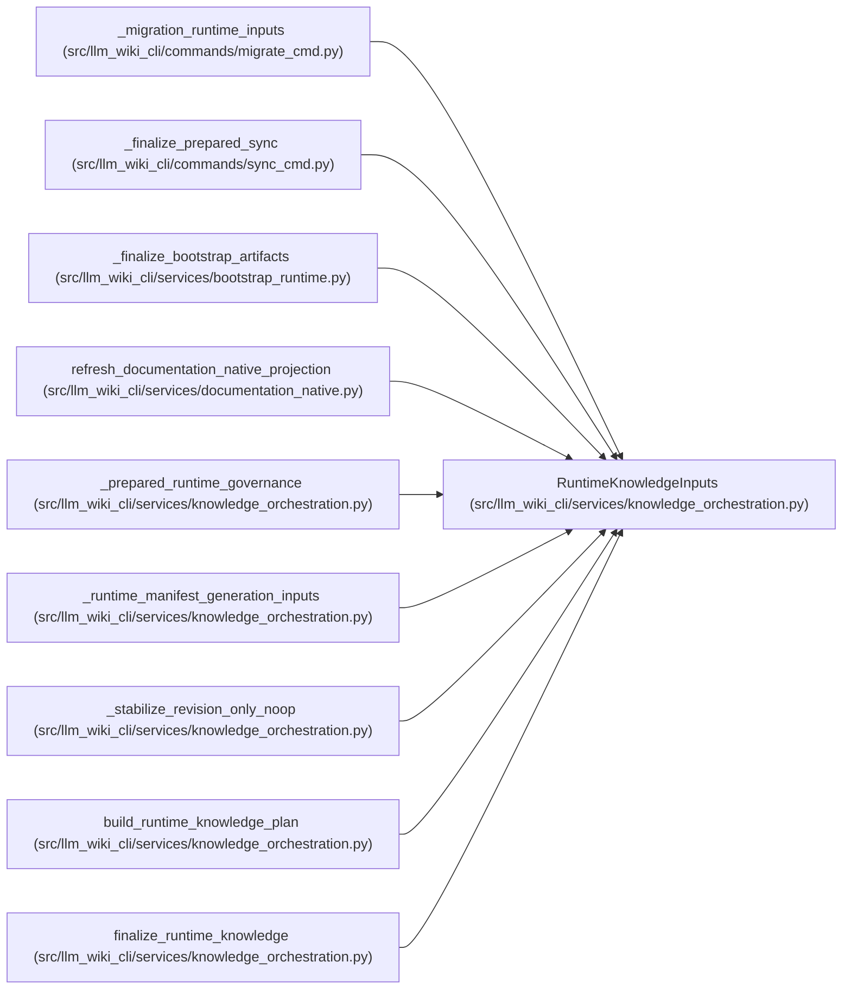

# RuntimeKnowledgeInputs

**Location:** `src/llm_wiki_cli/services/knowledge_orchestration.py:126`
**Kind:** Class
**Bases:** —
**Module:** [knowledge_orchestration](../modules/knowledge_orchestration.md)

**Decorators:** `@dataclass(frozen=True)`

## Description

Evaluated command state needed to plan one three-artifact commit.

## Attributes

| Name | Type | Default | Description |
|------|------|---------|-------------|
| `target_wiki_dir` | `str \| Path` | *required* | — |
| `inventory` | `Mapping[str, Mapping[str, Any]]` | *required* | — |
| `surface` | `SurfaceIndexEvaluation` | *required* | — |
| `source_snapshot` | `SourceSnapshot` | *required* | — |
| `module_page_map` | `Mapping[str, str]` | *required* | — |
| `entity_occurrence_page_map` | `Mapping[tuple[str, str, int], str]` | *required* | — |
| `repository_evidence` | `RepositoryEvidence` | *required* | — |
| `inventory_complete` | `bool` | *required* | — |
| `previous_manifest` | `SyncManifest \| None` | `None` | — |
| `next_manifest` | `SyncManifest \| None` | `None` | — |
| `manifest_surfaces` | `Mapping[str, Mapping[str, Any]] \| None` | `None` | — |
| `manifest_generation_inputs` | `Mapping[str, object] \| None` | `None` | — |
| `unknown_evidence_reason` | `str` | `EVIDENCE_NOT_RECORDED` | — |
| `force_unknown_evidence` | `bool` | `False` | — |
| `untrusted_evidence_page_paths` | `AbstractSet[str]` | `frozenset()` | — |
| `regenerated_evidence_page_paths` | `AbstractSet[str]` | `frozenset()` | — |
| `extractor_registry` | `Mapping[str, str]` | `field(default_factory=dict)` | — |
| `plugin_extractor_components` | `Sequence[Mapping[str, Any]]` | `()` | — |
| `plugin_components` | `Sequence[Mapping[str, Any]]` | `()` | — |
| `plugin_lock_path` | `str \| None` | `None` | — |
| `plugin_lock_hash` | `str \| None` | `None` | — |
| `generation_options` | `Mapping[str, Any]` | `field(default_factory=dict)` | — |
| `generation_option_defaults` | `Mapping[str, Any]` | `field(default_factory=dict)` | — |
| `generation_option_allowlist` | `Sequence[str]` | `()` | — |
| `call_edges` | `Mapping[str, Any] \| Sequence[Mapping[str, Any]]` | `()` | — |
| `dependency_observations` | `Mapping[str, Any] \| Sequence[Mapping[str, Any]]` | `()` | — |
| `entrypoint_observations` | `Mapping[str, Any] \| Sequence[Mapping[str, Any]]` | `()` | — |
| `flows` | `Sequence[Mapping[str, Any]]` | `()` | — |
| `data_flows` | `Sequence[Mapping[str, Any]]` | `()` | — |
| `external_dependencies` | `Sequence[Mapping[str, Any]]` | `()` | — |
| `graph_analyzer_limitations` | `Mapping[str, Sequence[str]]` | `field(default_factory=dict)` | — |
| `graph_evidence_limit` | `int` | `20` | — |
| `governance` | `GovernanceLedger \| None` | `None` | — |
| `governance_moves` | `Mapping[str, str]` | `field(default_factory=dict)` | — |

## Methods

*No public methods. Inherits from base classes.*

## Relationships

<!-- Auto-generated relationship summary. Do not edit by hand. -->

### Summary

| Module | Methods | Attributes |
|---|---:|---|
| [knowledge_orchestration](../modules/knowledge_orchestration.md) | 0 | `call_edges`, `data_flows`, `dependency_observations`, `entity_occurrence_page_map`, `entrypoint_observations`, `external_dependencies`, `extractor_registry`, `flows`, `force_unknown_evidence`, `generation_option_allowlist`, `generation_option_defaults`, `generation_options` |

### References

| Reference | Kind | Source |
|---|---|---|
| `_migration_runtime_inputs` | call | [migrate_cmd](../modules/migrate_cmd.md) |
| `_migration_runtime_inputs` | type_reference | [migrate_cmd](../modules/migrate_cmd.md) |
| `_finalize_prepared_sync` | call | [sync_cmd](../modules/sync_cmd.md) |
| `_finalize_bootstrap_artifacts` | call | [bootstrap_runtime](../modules/bootstrap_runtime.md) |
| `refresh_documentation_native_projection` | call | [documentation_native](../modules/documentation_native.md) |
| `_prepared_runtime_governance` | type_reference | [knowledge_orchestration](../modules/knowledge_orchestration.md) |
| `_runtime_manifest_generation_inputs` | type_reference | [knowledge_orchestration](../modules/knowledge_orchestration.md) |
| `_stabilize_revision_only_noop` | type_reference | [knowledge_orchestration](../modules/knowledge_orchestration.md) |
| `build_runtime_knowledge_plan` | type_reference | [knowledge_orchestration](../modules/knowledge_orchestration.md) |
| `finalize_runtime_knowledge` | type_reference | [knowledge_orchestration](../modules/knowledge_orchestration.md) |
