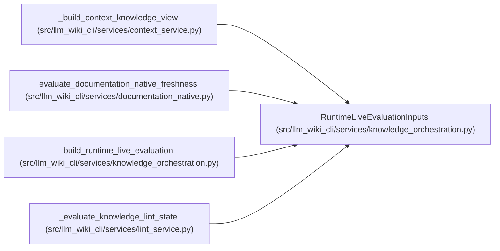

# RuntimeLiveEvaluationInputs

**Location:** `src/llm_wiki_cli/services/knowledge_orchestration.py:181`
**Kind:** Class
**Bases:** —
**Module:** [knowledge_orchestration](../modules/knowledge_orchestration.md)

**Decorators:** `@dataclass(frozen=True)`

## Description

Already evaluated runtime values for one live freshness comparison.

## Attributes

| Name | Type | Default | Description |
|------|------|---------|-------------|
| `knowledge` | `KnowledgeIndex` | *required* | — |
| `manifest` | `SyncManifest` | *required* | — |
| `inventory` | `Mapping[str, Mapping[str, Any]]` | *required* | — |
| `source_snapshot` | `SourceSnapshot` | *required* | — |
| `generation_options` | `Mapping[str, Any]` | *required* | — |
| `generation_option_defaults` | `Mapping[str, Any]` | *required* | — |
| `generation_option_allowlist` | `Sequence[str]` | *required* | — |
| `infrastructure_inventory` | `Mapping[str, Mapping[str, Any]]` | `field(default_factory=dict)` | — |
| `missing_source_paths` | `AbstractSet[str]` | `frozenset()` | — |
| `inventory_complete` | `bool` | `True` | — |
| `extractor_registry` | `Mapping[str, str]` | `field(default_factory=dict)` | — |
| `plugin_extractor_components` | `Sequence[Mapping[str, Any]]` | `()` | — |
| `plugin_components` | `Sequence[Mapping[str, Any]]` | `()` | — |

## Methods

*No public methods. Inherits from base classes.*

## Relationships

<!-- Auto-generated relationship summary. Do not edit by hand. -->

### Summary

| Module | Methods | Attributes |
|---|---:|---|
| [knowledge_orchestration](../modules/knowledge_orchestration.md) | 0 | `extractor_registry`, `generation_option_allowlist`, `generation_option_defaults`, `generation_options`, `infrastructure_inventory`, `inventory`, `inventory_complete`, `knowledge`, `manifest`, `missing_source_paths`, `plugin_components`, `plugin_extractor_components` |

### References

| Reference | Kind | Source | Call sites |
|---|---|---|---:|
| `_build_context_knowledge_view` | call | [context_service](../modules/context_service.md) | 1 |
| `evaluate_documentation_native_freshness` | call | [documentation_native](../modules/documentation_native.md) | 1 |
| `build_runtime_live_evaluation` | type_reference | [knowledge_orchestration](../modules/knowledge_orchestration.md) | — |
| `_evaluate_knowledge_lint_state` | call | [lint_service](../modules/lint_service.md) | 1 |
