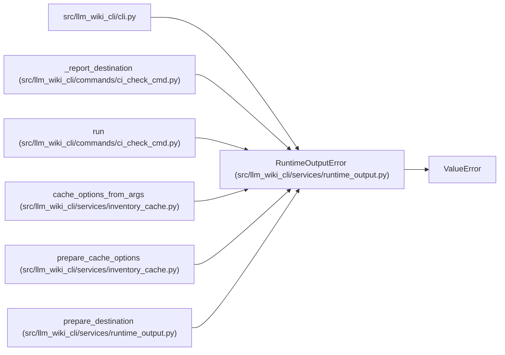

# RuntimeOutputError

**Location:** `src/llm_wiki_cli/services/runtime_output.py:13`
**Kind:** Class
**Bases:** `ValueError`
**Module:** [runtime_output](../modules/runtime_output.md)

## Description

An explicitly requested runtime destination is unusable.

## Attributes

*No annotated attributes found.*

## Methods

*No public methods. Inherits from base classes.*

## Relationships

<!-- Auto-generated relationship summary. Do not edit by hand. -->

### Summary

| Module | Methods | Attributes |
|---|---:|---|
| [runtime_output](../modules/runtime_output.md) | 0 | — |

### Structure

| Kind | Entity | Module |
|---|---|---|
| Base | `ValueError` | — |

### References

| Reference | Kind | Source | Call sites |
|---|---|---|---:|
| `cli` | import | [cli](../modules/cli.md) | — |
| `_report_destination` | call | [ci_check_cmd](../modules/ci_check_cmd.md) | 2 |
| `run` | call | [ci_check_cmd](../modules/ci_check_cmd.md) | 1 |
| `cache_options_from_args` | call | [inventory_cache](../modules/inventory_cache.md) | 2 |
| `prepare_cache_options` | call | [inventory_cache](../modules/inventory_cache.md) | 1 |
| `prepare_destination` | call | [runtime_output](../modules/runtime_output.md) | 1 |
