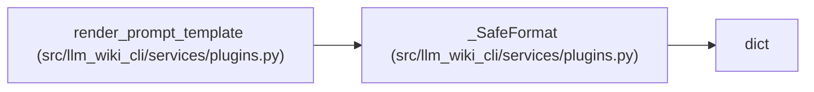

# _SafeFormat

**Location:** `src/llm_wiki_cli/services/plugins.py:741`
**Kind:** Class
**Bases:** `dict`
**Module:** [plugins](../modules/plugins.md)

## Description

_Auto-generated from `_SafeFormat` in `src/llm_wiki_cli/services/plugins.py`._

## Attributes

*No annotated attributes found.*

## Methods

| Method | Signature | Decorators | Description |
|--------|-----------|------------|-------------|
| `__missing__` | `(key: str) -> str` | — | — |

## Relationships

<!-- Auto-generated relationship summary. Do not edit by hand. -->

### Summary

| Module | Methods | Attributes |
|---|---:|---|
| [plugins](../modules/plugins.md) | 1 | — |

### Structure

| Kind | Entity | Module |
|---|---|---|
| Base | `dict` | — |

### References

| Reference | Kind | Source |
|---|---|---|
| `render_prompt_template` | call | [plugins](../modules/plugins.md) |
