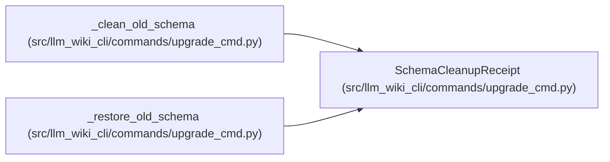

# SchemaCleanupReceipt

**Location:** `src/llm_wiki_cli/commands/upgrade_cmd.py:108`
**Kind:** Class
**Bases:** —
**Module:** [upgrade_cmd](../modules/upgrade_cmd.md)

**Decorators:** `@dataclass(frozen=True)`

## Description

Reversible source-schema mutation held until cleanup is committed.

## Attributes

| Name | Type | Default | Description |
|------|------|---------|-------------|
| `path` | `Path` | *required* | — |
| `before` | `bytes` | *required* | — |
| `after` | `bytes \| None` | *required* | — |

## Methods

*No public methods. Inherits from base classes.*

## Relationships

<!-- Auto-generated relationship summary. Do not edit by hand. -->

### Summary

| Module | Methods | Attributes |
|---|---:|---|
| [upgrade_cmd](../modules/upgrade_cmd.md) | 0 | `after`, `before`, `path` |

### References

| Reference | Kind | Source |
|---|---|---|
| `_clean_old_schema` | call | [upgrade_cmd](../modules/upgrade_cmd.md) |
| `_clean_old_schema` | call | [upgrade_cmd](../modules/upgrade_cmd.md) |
| `_clean_old_schema` | type_reference | [upgrade_cmd](../modules/upgrade_cmd.md) |
| `_restore_old_schema` | type_reference | [upgrade_cmd](../modules/upgrade_cmd.md) |
