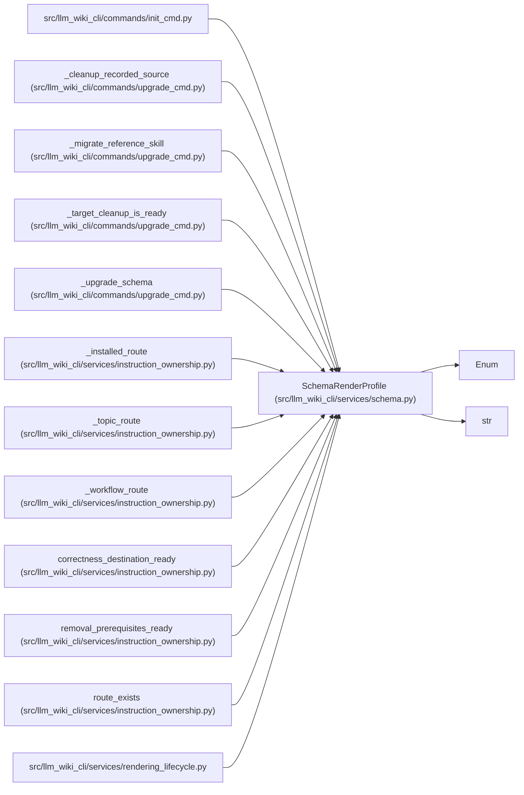

# SchemaRenderProfile

**Location:** `src/llm_wiki_cli/services/schema.py:27`
**Kind:** Enum
**Bases:** `str`, `Enum`
**Module:** [services_schema](../modules/services_schema.md)

## Description

Supported managed-schema rendering profiles.

## Attributes

| Name | Declared value | Description |
|------|-------|-------------|
| `COMPACT` | `'compact'` | — |
| `EXPANDED_INLINE` | `'expanded_inline'` | — |

## Methods

*No public methods. Inherits from base classes.*

## Relationships

<!-- Auto-generated relationship summary. Do not edit by hand. -->

### Summary

| Module | Methods | Attributes |
|---|---:|---|
| [services_schema](../modules/services_schema.md) | 0 | `COMPACT`, `EXPANDED_INLINE` |

### Structure

| Kind | Entity | Module |
|---|---|---|
| Base | `Enum` | — |
| Base | `str` | — |

### References

| Reference | Kind | Source |
|---|---|---|
| `init_cmd` | import | [init_cmd](../modules/init_cmd.md) |
| `_cleanup_recorded_source` | type_reference | [upgrade_cmd](../modules/upgrade_cmd.md) |
| `_migrate_reference_skill` | type_reference | [upgrade_cmd](../modules/upgrade_cmd.md) |
| `_target_cleanup_is_ready` | type_reference | [upgrade_cmd](../modules/upgrade_cmd.md) |
| `_upgrade_schema` | type_reference | [upgrade_cmd](../modules/upgrade_cmd.md) |
| `_installed_route` | type_reference | [instruction_ownership](../modules/instruction_ownership.md) |
| `_topic_route` | type_reference | [instruction_ownership](../modules/instruction_ownership.md) |
| `_workflow_route` | type_reference | [instruction_ownership](../modules/instruction_ownership.md) |
| `correctness_destination_ready` | type_reference | [instruction_ownership](../modules/instruction_ownership.md) |
| `removal_prerequisites_ready` | type_reference | [instruction_ownership](../modules/instruction_ownership.md) |
| `route_exists` | type_reference | [instruction_ownership](../modules/instruction_ownership.md) |
| `rendering_lifecycle` | import | [rendering_lifecycle](../modules/rendering_lifecycle.md) |
