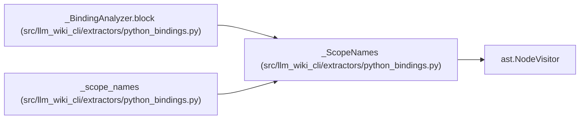

# _ScopeNames

**Location:** `src/llm_wiki_cli/extractors/python_bindings.py:33`
**Kind:** Class
**Bases:** `ast.NodeVisitor`
**Module:** [python_bindings](../modules/python_bindings.md)

## Description

_Auto-generated from `_ScopeNames` in `src/llm_wiki_cli/extractors/python_bindings.py`._

## Attributes

*No annotated attributes found.*

## Methods

| Method | Signature | Decorators | Description |
|--------|-----------|------------|-------------|
| `__init__` | `()` | — | — |
| `visit_Name` | `(node)` | — | — |
| `visit_FunctionDef` | `(node)` | — | — |
| `visit_AsyncFunctionDef` | `(node)` | — | — |
| `visit_ClassDef` | `(node)` | — | — |
| `visit_Lambda` | `(node)` | — | — |
| `visit_Import` | `(node)` | — | — |
| `visit_ImportFrom` | `(node)` | — | — |
| `visit_Global` | `(node)` | — | — |
| `visit_Nonlocal` | `(node)` | — | — |
| `visit_MatchAs` | `(node)` | — | — |
| `visit_MatchStar` | `(node)` | — | — |
| `visit_MatchMapping` | `(node)` | — | — |
| `visit_ExceptHandler` | `(node)` | — | — |
| `_comprehension` | `(node: ast.AST)` | — | — |
| `visit_ListComp` | `(node)` | — | — |
| `visit_SetComp` | `(node)` | — | — |
| `visit_DictComp` | `(node)` | — | — |
| `visit_GeneratorExp` | `(node)` | — | — |

## Relationships

<!-- Auto-generated relationship summary. Do not edit by hand. -->

### Summary

| Module | Methods | Attributes |
|---|---:|---|
| [python_bindings](../modules/python_bindings.md) | 19 | — |

### Structure

| Kind | Entity | Module |
|---|---|---|
| Base | `ast.NodeVisitor` | — |

### References

| Reference | Kind | Source | Call sites |
|---|---|---|---:|
| `_BindingAnalyzer.block` | call | [python_bindings](../modules/python_bindings.md) | 1 |
| `_scope_names` | call | [python_bindings](../modules/python_bindings.md) | 1 |
| `_scope_names` | type_reference | [python_bindings](../modules/python_bindings.md) | — |
