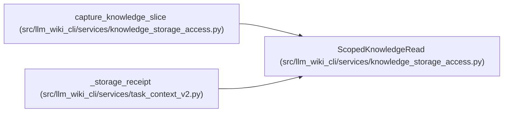

# ScopedKnowledgeRead

**Location:** `src/llm_wiki_cli/services/knowledge_storage_access.py:28`
**Kind:** Class
**Bases:** —
**Module:** [knowledge_storage_access](../modules/knowledge_storage_access.md)

**Decorators:** `@dataclass`

## Description

Owns a selected logical slice, its validated manifest header, consumed Markdown and guarded read observations. Calling `finish` rechecks the consumed files and ranges before publication. It does not issue a full-artifact validation token.

## Attributes

| Name | Type | Default | Description |
|------|------|---------|-------------|
| `slice` | `KnowledgeSlice` | *required* | — |
| `manifest` | `ValidatedManifestHeader` | *required* | — |
| `markdown` | `dict[str, str]` | *required* | — |
| `reader` | `KnowledgeStoreReader` | `field(repr=False)` | — |
| `session` | `StorageReadSession` | `field(repr=False)` | — |

## Methods

| Method | Signature | Decorators | Description |
|--------|-----------|------------|-------------|
| `finish` | `() -> dict[str, Any]` | — | — |

## Relationships

<!-- Auto-generated relationship summary. Do not edit by hand. -->

### Summary

| Module | Methods | Attributes |
|---|---:|---|
| [knowledge_storage_access](../modules/knowledge_storage_access.md) | 1 | `manifest`, `markdown`, `reader`, `session`, `slice` |

### References

| Reference | Kind | Source | Call sites |
|---|---|---|---:|
| `capture_knowledge_slice` | call | [knowledge_storage_access](../modules/knowledge_storage_access.md) | 1 |
| `capture_knowledge_slice` | type_reference | [knowledge_storage_access](../modules/knowledge_storage_access.md) | — |
| `_storage_receipt` | type_reference | [task_context_v2](../modules/task_context_v2.md) | — |
