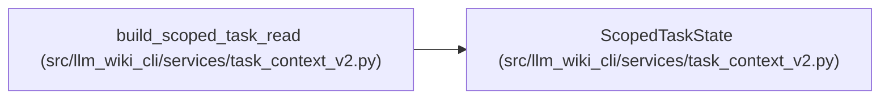

# ScopedTaskState

**Location:** `src/llm_wiki_cli/services/task_context_v2.py:195`
**Kind:** Class
**Bases:** —
**Module:** [task_context_v2](../modules/task_context_v2.md)

**Decorators:** `@dataclass(frozen=True)`

## Description

Retains private workspace roots, source capture, consumed storage observations and change-selection bindings for a task v2 session. Revalidation accounts for work even when it fails and permits cache reuse only when the captured capabilities support it.

## Attributes

| Name | Type | Default | Description |
|------|------|---------|-------------|
| `source_root` | `Path` | *required* | — |
| `wiki_root` | `Path` | *required* | — |
| `snapshot` | `SourceSnapshot \| None` | *required* | — |
| `source_anchor` | `str \| None` | *required* | — |
| `wiki_inputs` | `Mapping[str, ReadObservation]` | *required* | — |
| `cacheable` | `bool` | *required* | — |
| `changes` | `Any` | *required* | — |
| `change_request` | `Any` | *required* | — |
| `native_absent` | `bool` | `False` | — |
| `original_work` | `Mapping[str, Any] \| None` | `None` | — |

## Methods

| Method | Signature | Decorators | Description |
|--------|-----------|------------|-------------|
| `revalidate` | `(settings, *, source_metrics = None, wiki_metrics = None)` | — | — |

## Relationships

<!-- Auto-generated relationship summary. Do not edit by hand. -->

### Summary

| Module | Methods | Attributes |
|---|---:|---|
| [task_context_v2](../modules/task_context_v2.md) | 1 | `cacheable`, `change_request`, `changes`, `native_absent`, `original_work`, `snapshot`, `source_anchor`, `source_root`, `wiki_inputs`, `wiki_root` |

### References

| Reference | Kind | Source | Call sites |
|---|---|---|---:|
| `build_scoped_task_read` | call | [task_context_v2](../modules/task_context_v2.md) | 1 |