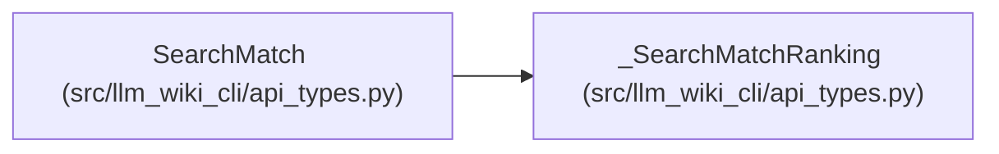

# SearchMatch

**Location:** `src/llm_wiki_cli/api_types.py:61`
**Kind:** Class
**Bases:** `_SearchMatchRanking`
**Module:** [api_types](../modules/api_types.md)

## Description

A canonical wiki result coordinate with title and snippet. Ranked matches additionally expose score, reasons and provenance; these retrieval signals do not replace exact source or concept inspection.

## Attributes

| Name | Type | Presence | Description |
|------|------|----------|-------------|
| `kind` | `str` | *required* | — |
| `id` | `str` | *required* | — |
| `uri` | `str` | *required* | — |
| `path` | `str` | *required* | — |
| `title` | `str` | *required* | — |
| `snippet` | `str` | *required* | — |

## Methods

*No public methods. Inherits from base classes.*

## Relationships

<!-- Auto-generated relationship summary. Do not edit by hand. -->

### Summary

| Module | Methods | Attributes |
|---|---:|---|
| [api_types](../modules/api_types.md) | 0 | `id`, `kind`, `path`, `snippet`, `title`, `uri` |

### Structure

| Kind | Entity | Module |
|---|---|---|
| Base | `_SearchMatchRanking` | [api_types](../modules/api_types.md) |
