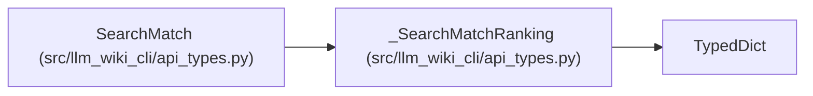

# _SearchMatchRanking

**Location:** `src/llm_wiki_cli/api_types.py:55`
**Kind:** Class
**Bases:** `TypedDict`
**Module:** [api_types](../modules/api_types.md)

## Description

Optional metadata attached to ranked discovery matches: lexical score, inspectable ranking reasons and corpus provenance. These fields describe retrieval, not a correctness verdict.

## Attributes

| Name | Type | Presence | Description |
|------|------|----------|-------------|
| `score` | `float` | *optional* | — |
| `reasons` | `list[str]` | *optional* | — |
| `provenance` | `dict[str, str]` | *optional* | — |

## Methods

*No public methods. Inherits from base classes.*

## Relationships

<!-- Auto-generated relationship summary. Do not edit by hand. -->

### Summary

| Module | Methods | Attributes |
|---|---:|---|
| [api_types](../modules/api_types.md) | 0 | `provenance`, `reasons`, `score` |

### Structure

| Kind | Entity | Module |
|---|---|---|
| Base | `TypedDict` | — |
| Subclass | `SearchMatch` | [api_types](../modules/api_types.md) |
