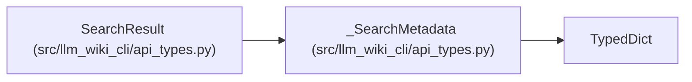

# _SearchMetadata

**Location:** `src/llm_wiki_cli/api_types.py:62`
**Kind:** Class
**Bases:** `TypedDict`
**Module:** [api_types](../modules/api_types.md)

## Description

Optional corpus identity, scan counts and resource limits for ranked search. Reported wiki scan work is separate from context output size and host model usage.

## Attributes

| Name | Type | Presence | Description |
|------|------|----------|-------------|
| `ranking` | `str` | *optional* | — |
| `corpus_id` | `str` | *optional* | — |
| `scanned` | `dict[str, int]` | *optional* | — |
| `resource_limits` | `dict[str, int]` | *optional* | — |

## Methods

*No public methods. Inherits from base classes.*

## Relationships

<!-- Auto-generated relationship summary. Do not edit by hand. -->

### Summary

| Module | Methods | Attributes |
|---|---:|---|
| [api_types](../modules/api_types.md) | 0 | `corpus_id`, `ranking`, `resource_limits`, `scanned` |

### Structure

| Kind | Entity | Module |
|---|---|---|
| Base | `TypedDict` | — |
| Subclass | `SearchResult` | [api_types](../modules/api_types.md) |
