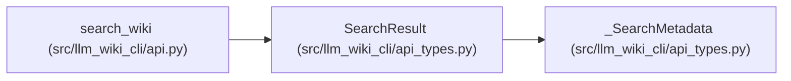

# SearchResult

**Location:** `src/llm_wiki_cli/api_types.py:69`
**Kind:** Class
**Bases:** `_SearchMetadata`
**Module:** [api_types](../modules/api_types.md)

## Description

A bounded lexical discovery response. Ranked results include reasons and corpus provenance; substring results preserve their compatibility behavior. A lexical hit proposes a coordinate and does not establish task relevance or semantic truth.

## Attributes

| Name | Type | Presence | Description |
|------|------|----------|-------------|
| `query` | `str` | *required* | — |
| `mode` | `Literal['ranked', 'substring']` | *required* | — |
| `total` | `int` | *required* | — |
| `returned` | `int` | *required* | — |
| `count` | `int` | *required* | — |
| `truncated` | `bool` | *required* | — |
| `bounds` | `dict[str, ResultBounds]` | *required* | — |
| `results` | `list[SearchMatch]` | *required* | — |

## Methods

*No public methods. Inherits from base classes.*

## Relationships

<!-- Auto-generated relationship summary. Do not edit by hand. -->

### Summary

| Module | Methods | Attributes |
|---|---:|---|
| [api_types](../modules/api_types.md) | 0 | `bounds`, `count`, `mode`, `query`, `results`, `returned`, `total`, `truncated` |

### Structure

| Kind | Entity | Module |
|---|---|---|
| Base | `_SearchMetadata` | [api_types](../modules/api_types.md) |

### References

| Reference | Kind | Source | Call sites |
|---|---|---|---:|
| `search_wiki` | type_reference | [api](../modules/api.md) | — |