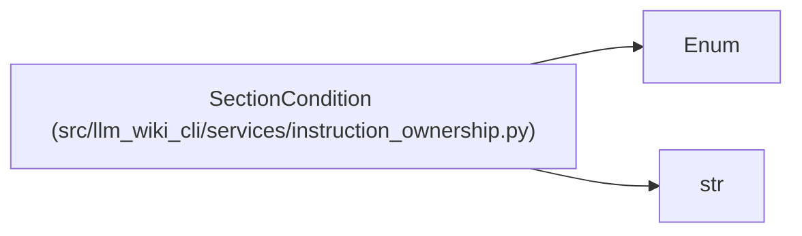

# SectionCondition

**Location:** `src/llm_wiki_cli/services/instruction_ownership.py:40`
**Kind:** Enum
**Bases:** `str`, `Enum`
**Module:** [instruction_ownership](../modules/instruction_ownership.md)

## Description

Configuration switch controlling a current generated section.

## Attributes

| Name | Declared value | Description |
|------|-------|-------------|
| `ALWAYS` | `'always'` | — |
| `QUALITY_HINTS` | `'quality_hints'` | — |
| `ISSUE_REPORTING` | `'issue_reporting'` | — |

## Methods

*No public methods. Inherits from base classes.*

## Relationships

<!-- Auto-generated relationship summary. Do not edit by hand. -->

### Summary

| Module | Methods | Attributes |
|---|---:|---|
| [instruction_ownership](../modules/instruction_ownership.md) | 0 | `ALWAYS`, `ISSUE_REPORTING`, `QUALITY_HINTS` |

### Structure

| Kind | Entity | Module |
|---|---|---|
| Base | `Enum` | — |
| Base | `str` | — |
