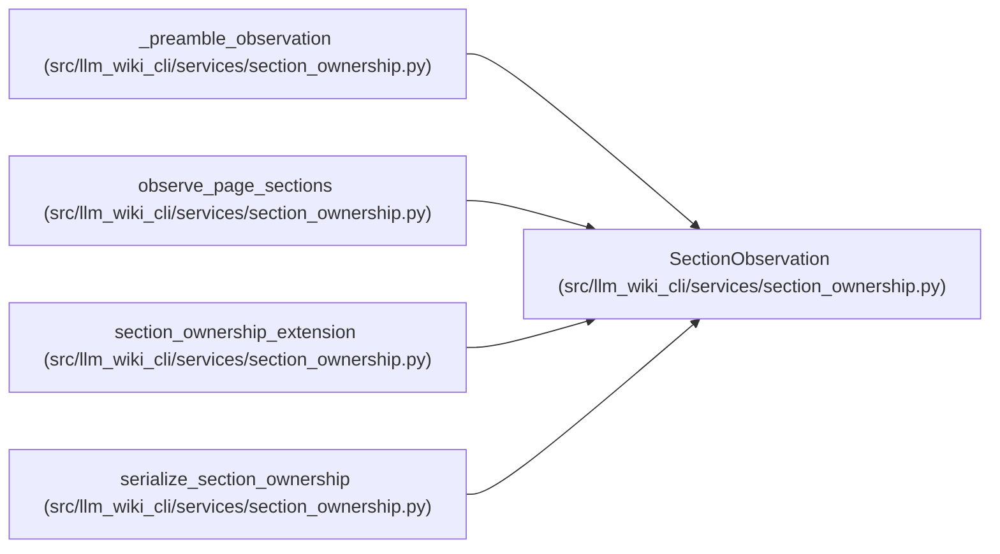

# SectionObservation

**Location:** `src/llm_wiki_cli/services/section_ownership.py:69`
**Kind:** Class
**Bases:** —
**Module:** [section_ownership](../modules/section_ownership.md)

**Decorators:** `@dataclass(frozen=True)`

## Description

One ordered section plus its exact and ownership-scoped commitments.

## Attributes

| Name | Type | Default | Description |
|------|------|---------|-------------|
| `locator` | `str` | *required* | — |
| `page_locator` | `str` | *required* | — |
| `heading_path` | `tuple[str, ...]` | *required* | — |
| `title` | `str \| None` | *required* | — |
| `level` | `int` | *required* | — |
| `occurrence` | `int` | *required* | — |
| `ordinal` | `int` | *required* | — |
| `parent_locator` | `str \| None` | *required* | — |
| `ownership` | `SectionOwnership` | *required* | — |
| `exact_hash` | `str` | *required* | — |
| `structural_hash` | `str \| None` | `None` | — |
| `semantic_hash` | `str \| None` | `None` | — |
| `occurrence_path` | `tuple[int, ...]` | `()` | — |

## Methods

| Method | Signature | Decorators | Description |
|--------|-----------|------------|-------------|
| `to_payload` | `() -> dict[str, object]` | — | Return the stable extension representation. |

## Relationships

<!-- Auto-generated relationship summary. Do not edit by hand. -->

### Summary

| Module | Methods | Attributes |
|---|---:|---|
| [section_ownership](../modules/section_ownership.md) | 1 | `exact_hash`, `heading_path`, `level`, `locator`, `occurrence`, `occurrence_path`, `ordinal`, `ownership`, `page_locator`, `parent_locator`, `semantic_hash`, `structural_hash` |

### References

| Reference | Kind | Source | Call sites |
|---|---|---|---:|
| `_preamble_observation` | call | [section_ownership](../modules/section_ownership.md) | 1 |
| `_preamble_observation` | type_reference | [section_ownership](../modules/section_ownership.md) | — |
| `observe_page_sections` | call | [section_ownership](../modules/section_ownership.md) | 1 |
| `observe_page_sections` | type_reference | [section_ownership](../modules/section_ownership.md) | — |
| `section_ownership_extension` | type_reference | [section_ownership](../modules/section_ownership.md) | — |
| `serialize_section_ownership` | type_reference | [section_ownership](../modules/section_ownership.md) | — |
