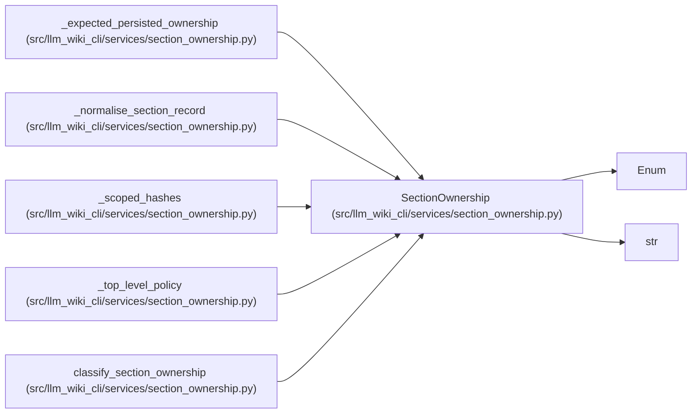

# SectionOwnership

**Location:** `src/llm_wiki_cli/services/section_ownership.py:50`
**Kind:** Enum
**Bases:** `str`, `Enum`
**Module:** [section_ownership](../modules/section_ownership.md)

## Description

The authority boundary of one parsed Markdown section.

## Attributes

| Name | Declared value | Description |
|------|-------|-------------|
| `GENERATED` | `'generated'` | — |
| `SEMANTIC` | `'semantic'` | — |
| `MIXED` | `'mixed'` | — |
| `UNKNOWN` | `'unknown'` | — |

## Methods

*No public methods. Inherits from base classes.*

## Relationships

<!-- Auto-generated relationship summary. Do not edit by hand. -->

### Summary

| Module | Methods | Attributes |
|---|---:|---|
| [section_ownership](../modules/section_ownership.md) | 0 | `GENERATED`, `MIXED`, `SEMANTIC`, `UNKNOWN` |

### Structure

| Kind | Entity | Module |
|---|---|---|
| Base | `Enum` | — |
| Base | `str` | — |

### References

| Reference | Kind | Source |
|---|---|---|
| `_expected_persisted_ownership` | type_reference | [section_ownership](../modules/section_ownership.md) |
| `_normalise_section_record` | call | [section_ownership](../modules/section_ownership.md) |
| `_scoped_hashes` | type_reference | [section_ownership](../modules/section_ownership.md) |
| `_top_level_policy` | type_reference | [section_ownership](../modules/section_ownership.md) |
| `classify_section_ownership` | type_reference | [section_ownership](../modules/section_ownership.md) |
