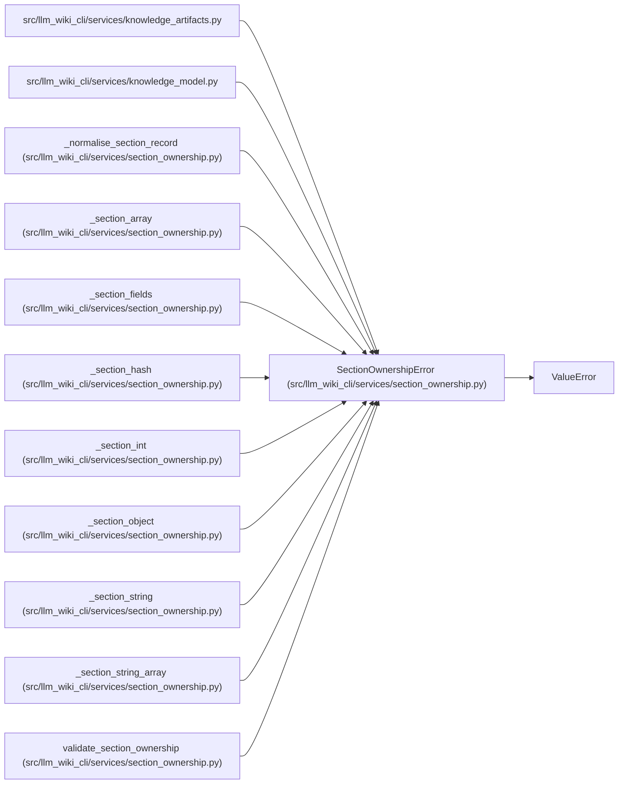

# SectionOwnershipError

**Location:** `src/llm_wiki_cli/services/section_ownership.py:59`
**Kind:** Class
**Bases:** `ValueError`
**Module:** [section_ownership](../modules/section_ownership.md)

## Description

Field-specific failure for the persisted section ownership contract.

## Attributes

*No annotated attributes found.*

## Methods

| Method | Signature | Decorators | Description |
|--------|-----------|------------|-------------|
| `__init__` | `(field: str, message: str)` | — | — |

## Relationships

<!-- Auto-generated relationship summary. Do not edit by hand. -->

### Summary

| Module | Methods | Attributes |
|---|---:|---|
| [section_ownership](../modules/section_ownership.md) | 1 | — |

### Structure

| Kind | Entity | Module |
|---|---|---|
| Base | `ValueError` | — |

### References

| Reference | Kind | Source | Call sites |
|---|---|---|---:|
| `knowledge_artifacts` | import | [knowledge_artifacts](../modules/knowledge_artifacts.md) | — |
| `knowledge_model` | import | [knowledge_model](../modules/knowledge_model.md) | — |
| `_normalise_section_record` | call | [section_ownership](../modules/section_ownership.md) | 15 |
| `_section_array` | call | [section_ownership](../modules/section_ownership.md) | 1 |
| `_section_fields` | call | [section_ownership](../modules/section_ownership.md) | 3 |
| `_section_hash` | call | [section_ownership](../modules/section_ownership.md) | 1 |
| `_section_int` | call | [section_ownership](../modules/section_ownership.md) | 1 |
| `_section_object` | call | [section_ownership](../modules/section_ownership.md) | 1 |
| `_section_string` | call | [section_ownership](../modules/section_ownership.md) | 1 |
| `_section_string_array` | call | [section_ownership](../modules/section_ownership.md) | 1 |
| `validate_section_ownership` | call | [section_ownership](../modules/section_ownership.md) | 14 |
