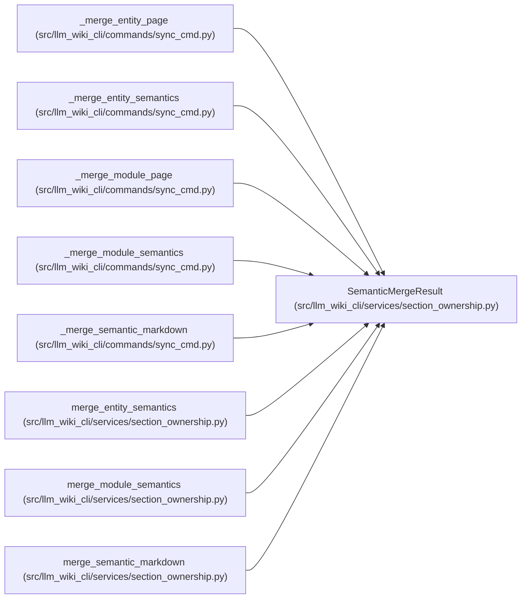

# SemanticMergeResult

**Location:** `src/llm_wiki_cli/services/section_ownership.py:133`
**Kind:** Class
**Bases:** —
**Module:** [section_ownership](../modules/section_ownership.md)

**Decorators:** `@dataclass(frozen=True)`

## Description

Regenerated Markdown and the number of semantic values restored.

## Attributes

| Name | Type | Default | Description |
|------|------|---------|-------------|
| `text` | `str` | *required* | — |
| `preserved` | `int` | `0` | — |

## Methods

*No public methods. Inherits from base classes.*

## Relationships

<!-- Auto-generated relationship summary. Do not edit by hand. -->

### Summary

| Module | Methods | Attributes |
|---|---:|---|
| [section_ownership](../modules/section_ownership.md) | 0 | `preserved`, `text` |

### References

| Reference | Kind | Source | Call sites |
|---|---|---|---:|
| `_merge_entity_page` | call | [sync_cmd](../modules/sync_cmd.md) | 1 |
| `_merge_entity_page` | type_reference | [sync_cmd](../modules/sync_cmd.md) | — |
| `_merge_entity_semantics` | type_reference | [sync_cmd](../modules/sync_cmd.md) | — |
| `_merge_module_page` | call | [sync_cmd](../modules/sync_cmd.md) | 1 |
| `_merge_module_page` | type_reference | [sync_cmd](../modules/sync_cmd.md) | — |
| `_merge_module_semantics` | type_reference | [sync_cmd](../modules/sync_cmd.md) | — |
| `_merge_semantic_markdown` | type_reference | [sync_cmd](../modules/sync_cmd.md) | — |
| `merge_entity_semantics` | type_reference | [section_ownership](../modules/section_ownership.md) | — |
| `merge_module_semantics` | type_reference | [section_ownership](../modules/section_ownership.md) | — |
| `merge_semantic_markdown` | call | [section_ownership](../modules/section_ownership.md) | 1 |
| `merge_semantic_markdown` | type_reference | [section_ownership](../modules/section_ownership.md) | — |
