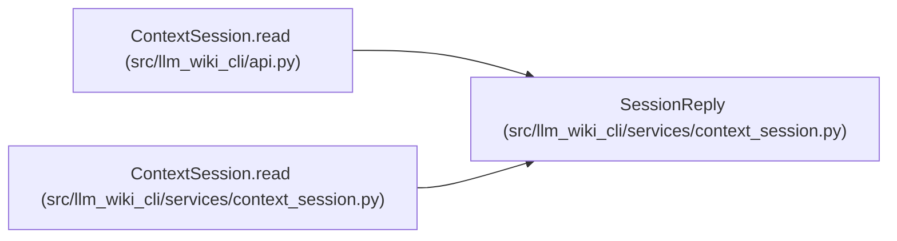

# SessionReply

**Location:** `src/llm_wiki_cli/services/context_session.py:122`
**Kind:** Class
**Bases:** —
**Module:** [context_session](../modules/context_session.md)

**Decorators:** `@dataclass(frozen=True)`

## Description

Separates full, unchanged or delta context delivery from session work telemetry. A matching result identity is returned unchanged only after current input validation. Delta consumers must reconstruct and validate the complete canonical task result.

## Attributes

| Name | Type | Default | Description |
|------|------|---------|-------------|
| `state` | `str` | *required* | — |
| `result_id` | `str \| None` | *required* | — |
| `context` | `TaskContext \| None` | *required* | — |
| `delta` | `Mapping[str, Any] \| None` | *required* | — |
| `_metadata` | `Mapping[str, Any]` | *required* | — |

## Methods

| Method | Signature | Decorators | Description |
|--------|-----------|------------|-------------|
| `metadata` | `() -> dict[str, Any]` | — | — |

## Relationships

<!-- Auto-generated relationship summary. Do not edit by hand. -->

### Summary

| Module | Methods | Attributes |
|---|---:|---|
| [context_session](../modules/context_session.md) | 1 | `_metadata`, `context`, `delta`, `result_id`, `state` |

### References

| Reference | Kind | Source | Call sites |
|---|---|---|---:|
| `ContextSession.read` | type_reference | [api](../modules/api.md) | — |
| `ContextSession.read` | call | [context_session](../modules/context_session.md) | 1 |
| `ContextSession.read` | type_reference | [context_session](../modules/context_session.md) | — |
