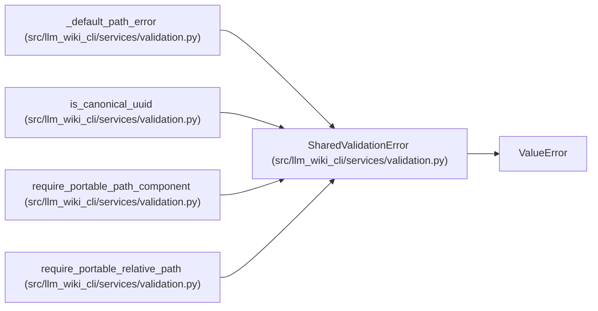

# SharedValidationError

**Location:** `src/llm_wiki_cli/services/validation.py:47`
**Kind:** Class
**Bases:** `ValueError`
**Module:** [validation](../modules/validation.md)

## Description

Raised when a caller uses a shared validator without a domain adapter.

## Attributes

*No annotated attributes found.*

## Methods

*No public methods. Inherits from base classes.*

## Relationships

<!-- Auto-generated relationship summary. Do not edit by hand. -->

### Summary

| Module | Methods | Attributes |
|---|---:|---|
| [validation](../modules/validation.md) | 0 | — |

### Structure

| Kind | Entity | Module |
|---|---|---|
| Base | `ValueError` | — |

### References

| Reference | Kind | Source |
|---|---|---|
| `_default_path_error` | call | [validation](../modules/validation.md) |
| `_default_path_error` | type_reference | [validation](../modules/validation.md) |
| `is_canonical_uuid` | call | [validation](../modules/validation.md) |
| `require_portable_path_component` | call | [validation](../modules/validation.md) |
| `require_portable_path_component` | call | [validation](../modules/validation.md) |
| `require_portable_path_component` | call | [validation](../modules/validation.md) |
| `require_portable_path_component` | call | [validation](../modules/validation.md) |
| `require_portable_path_component` | call | [validation](../modules/validation.md) |
| `require_portable_relative_path` | call | [validation](../modules/validation.md) |
