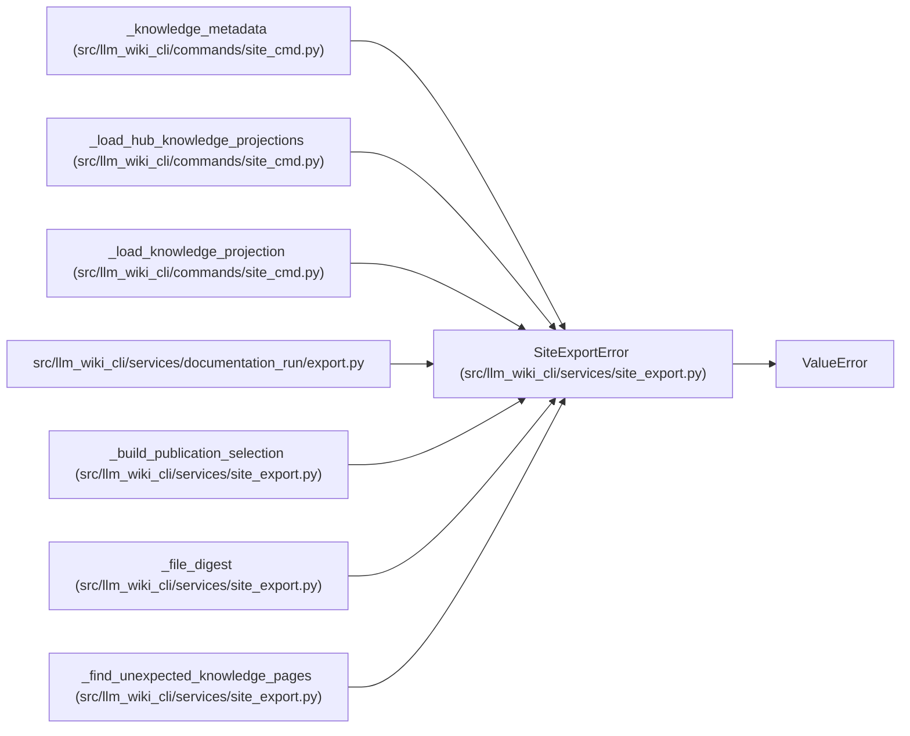

# SiteExportError

**Location:** `src/llm_wiki_cli/services/site_export.py:108`
**Kind:** Class
**Bases:** `ValueError`
**Module:** [site_export](../modules/site_export.md)

## Description

Raised for invalid static-site export requests.

## Attributes

*No annotated attributes found.*

## Methods

*No public methods. Inherits from base classes.*

## Relationships

<!-- Auto-generated relationship summary. Do not edit by hand. -->

### Summary

| Module | Methods | Attributes |
|---|---:|---|
| [site_export](../modules/site_export.md) | 0 | — |

### Structure

| Kind | Entity | Module |
|---|---|---|
| Base | `ValueError` | — |

### References

| Reference | Kind | Source |
|---|---|---|
| `_knowledge_metadata` | call | [site_cmd](../modules/site_cmd.md) |
| `_knowledge_metadata` | call | [site_cmd](../modules/site_cmd.md) |
| `_load_hub_knowledge_projections` | call | [site_cmd](../modules/site_cmd.md) |
| `_load_knowledge_projection` | call | [site_cmd](../modules/site_cmd.md) |
| `export` | import | [export](../modules/export.md) |
| `_build_publication_selection` | call | [site_export](../modules/site_export.md) |
| `_file_digest` | call | [site_export](../modules/site_export.md) |
| `_find_unexpected_knowledge_pages` | call | [site_export](../modules/site_export.md) |
| `_find_unexpected_knowledge_pages` | call | [site_export](../modules/site_export.md) |
| `_find_unexpected_knowledge_pages` | call | [site_export](../modules/site_export.md) |
| `_find_unexpected_knowledge_pages` | call | [site_export](../modules/site_export.md) |
| `_find_unexpected_knowledge_pages` | call | [site_export](../modules/site_export.md) |
