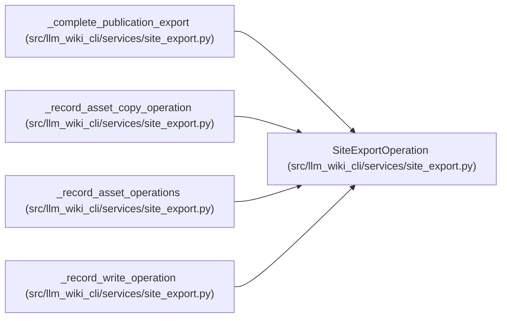

# SiteExportOperation

**Location:** `src/llm_wiki_cli/services/site_export.py:113`
**Kind:** Class
**Bases:** —
**Module:** [site_export](../modules/site_export.md)

**Decorators:** `@dataclass(frozen=True)`

## Description

_Auto-generated from `SiteExportOperation` in `src/llm_wiki_cli/services/site_export.py`._

## Attributes

| Name | Type | Default | Description |
|------|------|---------|-------------|
| `action` | `str` | *required* | — |
| `source` | `str` | *required* | — |
| `path` | `str` | *required* | — |
| `message` | `str` | `''` | — |

## Methods

*No public methods. Inherits from base classes.*

## Relationships

<!-- Auto-generated relationship summary. Do not edit by hand. -->

### Summary

| Module | Methods | Attributes |
|---|---:|---|
| [site_export](../modules/site_export.md) | 0 | `action`, `message`, `path`, `source` |

### References

| Reference | Kind | Source |
|---|---|---|
| `_complete_publication_export` | call | [site_export](../modules/site_export.md) |
| `_complete_publication_export` | call | [site_export](../modules/site_export.md) |
| `_complete_publication_export` | call | [site_export](../modules/site_export.md) |
| `_complete_publication_export` | call | [site_export](../modules/site_export.md) |
| `_record_asset_copy_operation` | call | [site_export](../modules/site_export.md) |
| `_record_asset_copy_operation` | call | [site_export](../modules/site_export.md) |
| `_record_asset_copy_operation` | call | [site_export](../modules/site_export.md) |
| `_record_asset_operations` | call | [site_export](../modules/site_export.md) |
| `_record_write_operation` | call | [site_export](../modules/site_export.md) |
| `_record_write_operation` | call | [site_export](../modules/site_export.md) |
| `_record_write_operation` | call | [site_export](../modules/site_export.md) |
