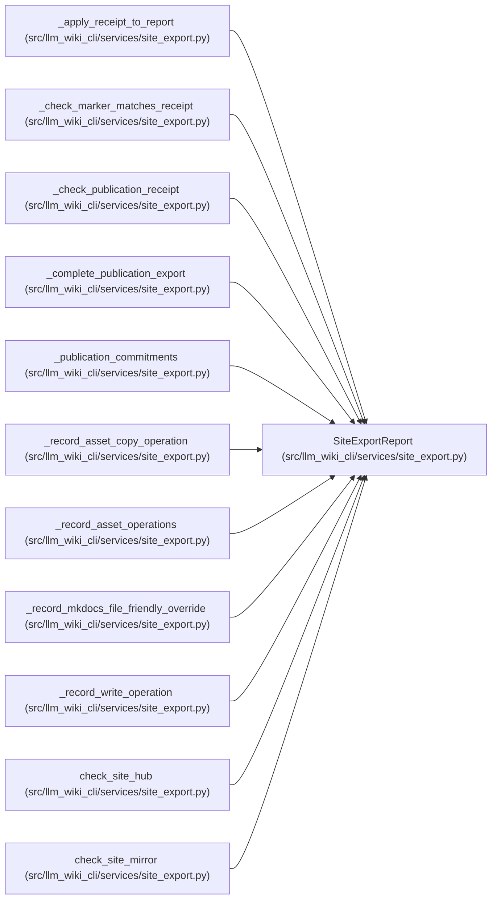

# SiteExportReport

**Location:** `src/llm_wiki_cli/services/site_export.py:168`
**Kind:** Class
**Bases:** —
**Module:** [site_export](../modules/site_export.md)

**Decorators:** `@dataclass`

## Description

_Auto-generated from `SiteExportReport` in `src/llm_wiki_cli/services/site_export.py`._

## Attributes

| Name | Type | Default | Description |
|------|------|---------|-------------|
| `ok` | `bool` | `True` | — |
| `dry_run` | `bool` | `False` | — |
| `wiki_dir` | `str` | `''` | — |
| `out_dir` | `str` | `''` | — |
| `built_site_dir` | `str` | `''` | — |
| `format` | `str` | `'plain'` | — |
| `profile` | `str` | `'reference'` | — |
| `site_name` | `str` | `''` | — |
| `distribution_mode` | `str` | `'http'` | — |
| `link_mode` | `str` | `''` | — |
| `front_matter` | `bool` | `False` | — |
| `publication_schema_version` | `str` | `''` | — |
| `publication_state` | `str` | `''` | — |
| `selection_id` | `str` | `''` | — |
| `export_id` | `str` | `''` | — |
| `page_count` | `int` | `0` | — |
| `source_count` | `int` | `0` | — |
| `asset_count` | `int` | `0` | — |
| `operations` | `list[SiteExportOperation]` | `field(default_factory=list)` | — |
| `asset_operations` | `list[SiteExportOperation]` | `field(default_factory=list)` | — |
| `issues` | `list[dict[str, str]]` | `field(default_factory=list)` | — |
| `warnings` | `list[dict[str, str]]` | `field(default_factory=list)` | — |
| `freshness` | `str \| None` | `None` | — |
| `freshness_by_source` | `dict[str, str]` | `field(default_factory=dict)` | — |

## Methods

| Method | Signature | Decorators | Description |
|--------|-----------|------------|-------------|
| `to_dict` | `() -> dict[str, Any]` | — | — |

## Relationships

<!-- Auto-generated relationship summary. Do not edit by hand. -->

### Summary

| Module | Methods | Attributes |
|---|---:|---|
| [site_export](../modules/site_export.md) | 1 | `asset_count`, `asset_operations`, `built_site_dir`, `distribution_mode`, `dry_run`, `export_id`, `format`, `freshness`, `freshness_by_source`, `front_matter`, `issues`, `link_mode` |

### References

| Reference | Kind | Source | Call sites |
|---|---|---|---:|
| `_apply_receipt_to_report` | type_reference | [site_export](../modules/site_export.md) | — |
| `_check_marker_matches_receipt` | type_reference | [site_export](../modules/site_export.md) | — |
| `_check_publication_receipt` | type_reference | [site_export](../modules/site_export.md) | — |
| `_complete_publication_export` | type_reference | [site_export](../modules/site_export.md) | — |
| `_publication_commitments` | type_reference | [site_export](../modules/site_export.md) | — |
| `_record_asset_copy_operation` | type_reference | [site_export](../modules/site_export.md) | — |
| `_record_asset_operations` | type_reference | [site_export](../modules/site_export.md) | — |
| `_record_mkdocs_file_friendly_override` | type_reference | [site_export](../modules/site_export.md) | — |
| `_record_write_operation` | type_reference | [site_export](../modules/site_export.md) | — |
| `check_site_hub` | call | [site_export](../modules/site_export.md) | 1 |
| `check_site_hub` | type_reference | [site_export](../modules/site_export.md) | — |
| `check_site_mirror` | call | [site_export](../modules/site_export.md) | 1 |

> References: showing 12 of 19 logical references; 7 omitted by the 12-row generated summary limit.
