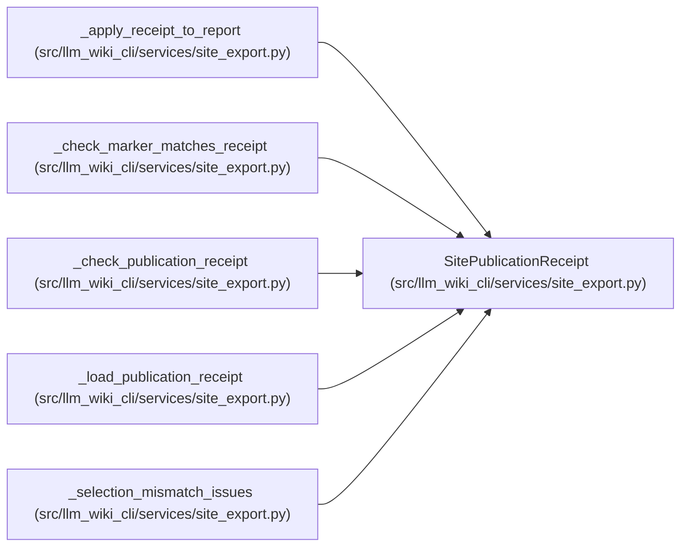

# SitePublicationReceipt

**Location:** `src/llm_wiki_cli/services/site_export.py:156`
**Kind:** Class
**Bases:** —
**Module:** [site_export](../modules/site_export.md)

**Decorators:** `@dataclass(frozen=True)`

## Description

Validated publication receipt loaded from an exported mirror.

## Attributes

| Name | Type | Default | Description |
|------|------|---------|-------------|
| `state` | `str` | *required* | — |
| `selection_id` | `str` | *required* | — |
| `export_id` | `str` | *required* | — |
| `selection` | `SitePublicationSelection` | *required* | — |
| `commitments` | `tuple[tuple[str, str], ...]` | *required* | — |
| `projection_hashes` | `tuple[str, ...]` | *required* | — |

## Methods

*No public methods. Inherits from base classes.*

## Relationships

<!-- Auto-generated relationship summary. Do not edit by hand. -->

### Summary

| Module | Methods | Attributes |
|---|---:|---|
| [site_export](../modules/site_export.md) | 0 | `commitments`, `export_id`, `projection_hashes`, `selection`, `selection_id`, `state` |

### References

| Reference | Kind | Source |
|---|---|---|
| `_apply_receipt_to_report` | type_reference | [site_export](../modules/site_export.md) |
| `_check_marker_matches_receipt` | type_reference | [site_export](../modules/site_export.md) |
| `_check_publication_receipt` | type_reference | [site_export](../modules/site_export.md) |
| `_load_publication_receipt` | call | [site_export](../modules/site_export.md) |
| `_load_publication_receipt` | type_reference | [site_export](../modules/site_export.md) |
| `_selection_mismatch_issues` | type_reference | [site_export](../modules/site_export.md) |
