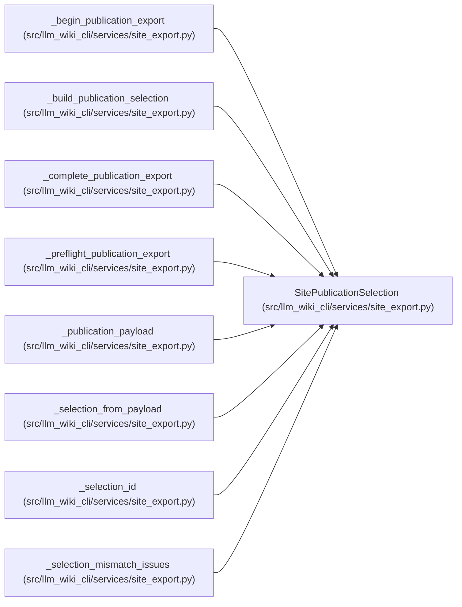

# SitePublicationSelection

**Location:** `src/llm_wiki_cli/services/site_export.py:121`
**Kind:** Class
**Bases:** —
**Module:** [site_export](../modules/site_export.md)

**Decorators:** `@dataclass(frozen=True)`

## Description

Immutable, path-safe policy selections for one generated site.

## Attributes

| Name | Type | Default | Description |
|------|------|---------|-------------|
| `format` | `str` | *required* | — |
| `profile` | `str` | *required* | — |
| `site_name` | `str` | *required* | — |
| `distribution_mode` | `str` | *required* | — |
| `front_matter` | `bool` | *required* | — |
| `knowledge_metadata` | `str` | *required* | — |
| `knowledge_profile` | `str` | *required* | — |
| `public_identity_digest` | `str` | *required* | — |
| `source_kind` | `str` | *required* | — |
| `source_identity` | `tuple[tuple[str, str], ...]` | *required* | — |

## Methods

| Method | Signature | Decorators | Description |
|--------|-----------|------------|-------------|
| `to_dict` | `() -> dict[str, Any]` | — | — |

## Relationships

<!-- Auto-generated relationship summary. Do not edit by hand. -->

### Summary

| Module | Methods | Attributes |
|---|---:|---|
| [site_export](../modules/site_export.md) | 1 | `distribution_mode`, `format`, `front_matter`, `knowledge_metadata`, `knowledge_profile`, `profile`, `public_identity_digest`, `site_name`, `source_identity`, `source_kind` |

### References

| Reference | Kind | Source | Call sites |
|---|---|---|---:|
| `_begin_publication_export` | type_reference | [site_export](../modules/site_export.md) | — |
| `_build_publication_selection` | call | [site_export](../modules/site_export.md) | 1 |
| `_build_publication_selection` | type_reference | [site_export](../modules/site_export.md) | — |
| `_complete_publication_export` | type_reference | [site_export](../modules/site_export.md) | — |
| `_preflight_publication_export` | type_reference | [site_export](../modules/site_export.md) | — |
| `_publication_payload` | type_reference | [site_export](../modules/site_export.md) | — |
| `_selection_from_payload` | call | [site_export](../modules/site_export.md) | 1 |
| `_selection_from_payload` | type_reference | [site_export](../modules/site_export.md) | — |
| `_selection_id` | type_reference | [site_export](../modules/site_export.md) | — |
| `_selection_mismatch_issues` | type_reference | [site_export](../modules/site_export.md) | — |
