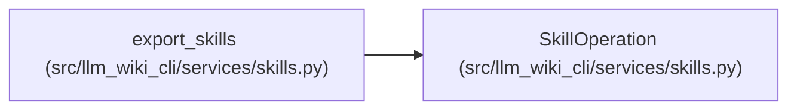

# SkillOperation

**Location:** `src/llm_wiki_cli/services/skills.py:154`
**Kind:** Class
**Bases:** —
**Module:** [skills](../modules/skills.md)

**Decorators:** `@dataclass`

## Description

_Auto-generated from `SkillOperation` in `src/llm_wiki_cli/services/skills.py`._

## Attributes

| Name | Type | Default | Description |
|------|------|---------|-------------|
| `action` | `str` | *required* | — |
| `path` | `str` | *required* | — |
| `message` | `str` | `''` | — |

## Methods

*No public methods. Inherits from base classes.*

## Relationships

<!-- Auto-generated relationship summary. Do not edit by hand. -->

### Summary

| Module | Methods | Attributes |
|---|---:|---|
| [skills](../modules/skills.md) | 0 | `action`, `message`, `path` |

### References

| Reference | Kind | Source | Call sites |
|---|---|---|---:|
| `export_skills` | call | [skills](../modules/skills.md) | 5 |
