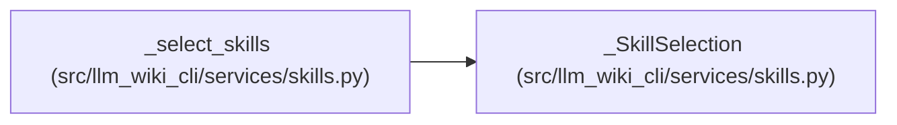

# _SkillSelection

**Location:** `src/llm_wiki_cli/services/skills.py:808`
**Kind:** Class
**Bases:** —
**Module:** [skills](../modules/skills.md)

**Decorators:** `@dataclass(frozen=True)`

## Description

One validated, dependency-closed skill selection.

## Attributes

| Name | Type | Default | Description |
|------|------|---------|-------------|
| `requested_ids` | `tuple[str, ...]` | *required* | — |
| `dependency_ids` | `tuple[str, ...]` | *required* | — |
| `skills` | `tuple[BundledSkill, ...]` | *required* | — |

## Methods

*No public methods. Inherits from base classes.*

## Relationships

<!-- Auto-generated relationship summary. Do not edit by hand. -->

### Summary

| Module | Methods | Attributes |
|---|---:|---|
| [skills](../modules/skills.md) | 0 | `dependency_ids`, `requested_ids`, `skills` |

### References

| Reference | Kind | Source | Call sites |
|---|---|---|---:|
| `_select_skills` | call | [skills](../modules/skills.md) | 1 |
| `_select_skills` | type_reference | [skills](../modules/skills.md) | — |
