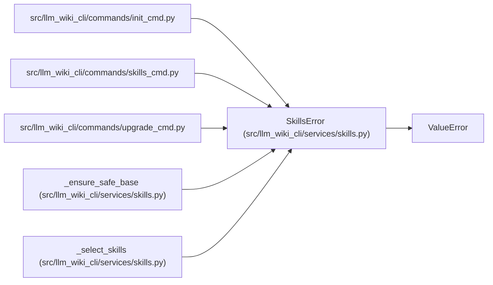

# SkillsError

**Location:** `src/llm_wiki_cli/services/skills.py:58`
**Kind:** Class
**Bases:** `ValueError`
**Module:** [skills](../modules/skills.md)

## Description

Raised for invalid skill list/export/install requests.

## Attributes

*No annotated attributes found.*

## Methods

*No public methods. Inherits from base classes.*

## Relationships

<!-- Auto-generated relationship summary. Do not edit by hand. -->

### Summary

| Module | Methods | Attributes |
|---|---:|---|
| [skills](../modules/skills.md) | 0 | — |

### Structure

| Kind | Entity | Module |
|---|---|---|
| Base | `ValueError` | — |

### References

| Reference | Kind | Source |
|---|---|---|
| `init_cmd` | import | [init_cmd](../modules/init_cmd.md) |
| `skills_cmd` | import | [skills_cmd](../modules/skills_cmd.md) |
| `upgrade_cmd` | import | [upgrade_cmd](../modules/upgrade_cmd.md) |
| `_ensure_safe_base` | call | [skills](../modules/skills.md) |
| `_select_skills` | call | [skills](../modules/skills.md) |
| `_select_skills` | call | [skills](../modules/skills.md) |
