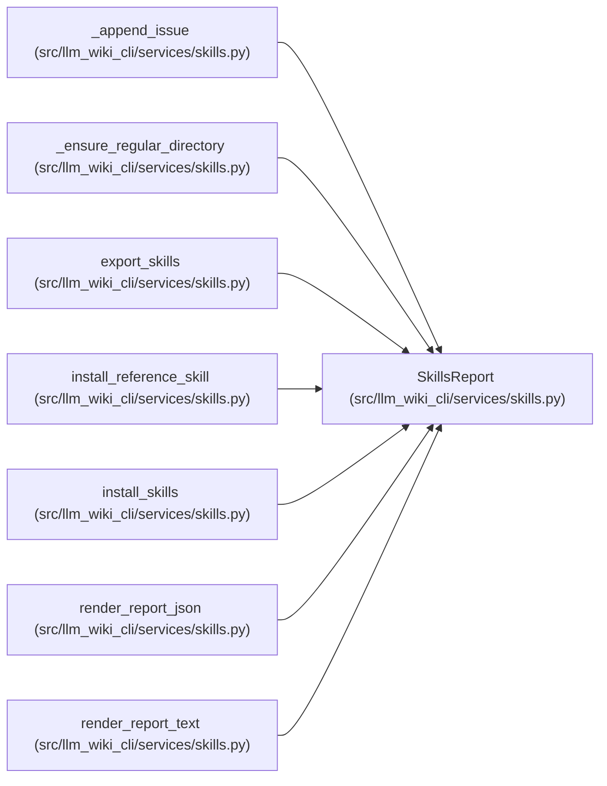

# SkillsReport

**Location:** `src/llm_wiki_cli/services/skills.py:152`
**Kind:** Class
**Bases:** —
**Module:** [skills](../modules/skills.md)

**Decorators:** `@dataclass`

## Description

_Auto-generated from `SkillsReport` in `src/llm_wiki_cli/services/skills.py`._

## Attributes

| Name | Type | Default | Description |
|------|------|---------|-------------|
| `ok` | `bool` | `True` | — |
| `dest_dir` | `str` | `''` | — |
| `skills` | `list[str]` | `field(default_factory=list)` | — |
| `operations` | `list[SkillOperation]` | `field(default_factory=list)` | — |
| `issues` | `list[dict[str, str]]` | `field(default_factory=list)` | — |

## Methods

| Method | Signature | Decorators | Description |
|--------|-----------|------------|-------------|
| `to_dict` | `() -> dict[str, Any]` | — | — |

## Relationships

<!-- Auto-generated relationship summary. Do not edit by hand. -->

### Summary

| Module | Methods | Attributes |
|---|---:|---|
| [skills](../modules/skills.md) | 1 | `dest_dir`, `issues`, `ok`, `operations`, `skills` |

### References

| Reference | Kind | Source |
|---|---|---|
| `_append_issue` | type_reference | [skills](../modules/skills.md) |
| `_ensure_regular_directory` | type_reference | [skills](../modules/skills.md) |
| `export_skills` | call | [skills](../modules/skills.md) |
| `export_skills` | type_reference | [skills](../modules/skills.md) |
| `install_reference_skill` | type_reference | [skills](../modules/skills.md) |
| `install_skills` | type_reference | [skills](../modules/skills.md) |
| `render_report_json` | type_reference | [skills](../modules/skills.md) |
| `render_report_text` | type_reference | [skills](../modules/skills.md) |
