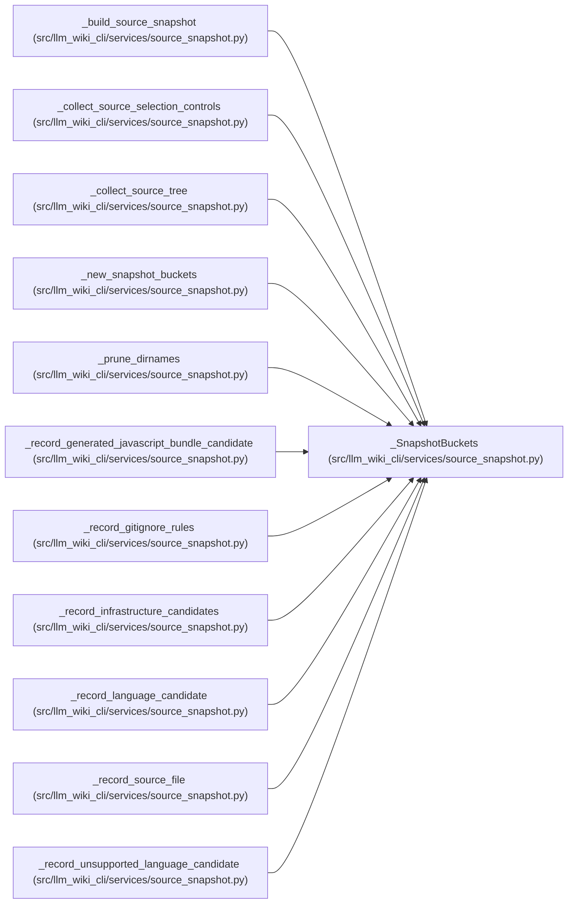

# _SnapshotBuckets

**Location:** `src/llm_wiki_cli/services/source_snapshot.py:396`
**Kind:** Class
**Bases:** —
**Module:** [source_snapshot](../modules/source_snapshot.md)

**Decorators:** `@dataclass`

## Description

_Auto-generated from `_SnapshotBuckets` in `src/llm_wiki_cli/services/source_snapshot.py`._

## Attributes

| Name | Type | Default | Description |
|------|------|---------|-------------|
| `files_by_language` | `dict[str, list[SourceFile]]` | *required* | — |
| `dockerfile_candidates` | `list[SourceFile]` | *required* | — |
| `compose_candidates` | `list[SourceFile]` | *required* | — |
| `yaml_candidates` | `list[SourceFile]` | *required* | — |
| `package_markers` | `list[SourceFile]` | *required* | — |
| `unsupported_files_by_language` | `dict[str, list[SourceFile]]` | *required* | — |
| `gitignore_contents` | `dict[str, bytes \| None]` | *required* | — |
| `gitignore_rules` | `list[_GitignoreRule]` | *required* | — |
| `include_tests` | `frozenset[str]` | *required* | — |
| `source_selection_policy` | `SourceSelectionPolicy \| None` | *required* | — |
| `selected_regular_paths` | `set[str]` | *required* | — |

## Methods

*No public methods. Inherits from base classes.*

## Relationships

<!-- Auto-generated relationship summary. Do not edit by hand. -->

### Summary

| Module | Methods | Attributes |
|---|---:|---|
| [source_snapshot](../modules/source_snapshot.md) | 0 | `compose_candidates`, `dockerfile_candidates`, `files_by_language`, `gitignore_contents`, `gitignore_rules`, `include_tests`, `package_markers`, `selected_regular_paths`, `source_selection_policy`, `unsupported_files_by_language`, `yaml_candidates` |

### References

| Reference | Kind | Source |
|---|---|---|
| `_build_source_snapshot` | type_reference | [source_snapshot](../modules/source_snapshot.md) |
| `_collect_source_selection_controls` | type_reference | [source_snapshot](../modules/source_snapshot.md) |
| `_collect_source_tree` | type_reference | [source_snapshot](../modules/source_snapshot.md) |
| `_new_snapshot_buckets` | call | [source_snapshot](../modules/source_snapshot.md) |
| `_new_snapshot_buckets` | type_reference | [source_snapshot](../modules/source_snapshot.md) |
| `_prune_dirnames` | type_reference | [source_snapshot](../modules/source_snapshot.md) |
| `_record_generated_javascript_bundle_candidate` | type_reference | [source_snapshot](../modules/source_snapshot.md) |
| `_record_gitignore_rules` | type_reference | [source_snapshot](../modules/source_snapshot.md) |
| `_record_infrastructure_candidates` | type_reference | [source_snapshot](../modules/source_snapshot.md) |
| `_record_language_candidate` | type_reference | [source_snapshot](../modules/source_snapshot.md) |
| `_record_source_file` | type_reference | [source_snapshot](../modules/source_snapshot.md) |
| `_record_unsupported_language_candidate` | type_reference | [source_snapshot](../modules/source_snapshot.md) |
