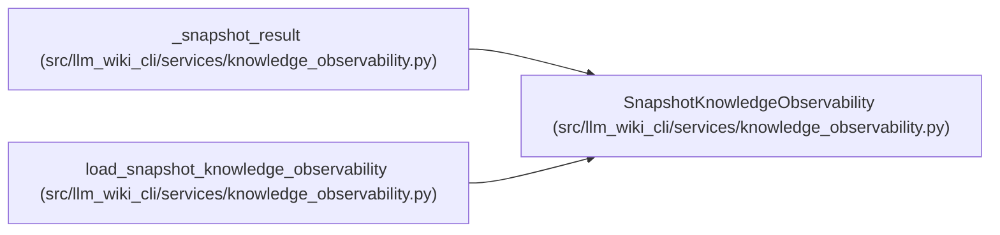

# SnapshotKnowledgeObservability

**Location:** `src/llm_wiki_cli/services/knowledge_observability.py:389`
**Kind:** Class
**Bases:** —
**Module:** [knowledge_observability](../modules/knowledge_observability.md)

**Decorators:** `@dataclass(frozen=True)`

## Description

One snapshot-only read view and its aggregate operational summary.

## Attributes

| Name | Type | Default | Description |
|------|------|---------|-------------|
| `view` | `KnowledgeReadView` | *required* | — |
| `summary` | `KnowledgeAggregateSummary` | *required* | — |

## Methods

*No public methods. Inherits from base classes.*

## Relationships

<!-- Auto-generated relationship summary. Do not edit by hand. -->

### Summary

| Module | Methods | Attributes |
|---|---:|---|
| [knowledge_observability](../modules/knowledge_observability.md) | 0 | `summary`, `view` |

### References

| Reference | Kind | Source |
|---|---|---|
| `_snapshot_result` | call | [knowledge_observability](../modules/knowledge_observability.md) |
| `_snapshot_result` | type_reference | [knowledge_observability](../modules/knowledge_observability.md) |
| `load_snapshot_knowledge_observability` | type_reference | [knowledge_observability](../modules/knowledge_observability.md) |
