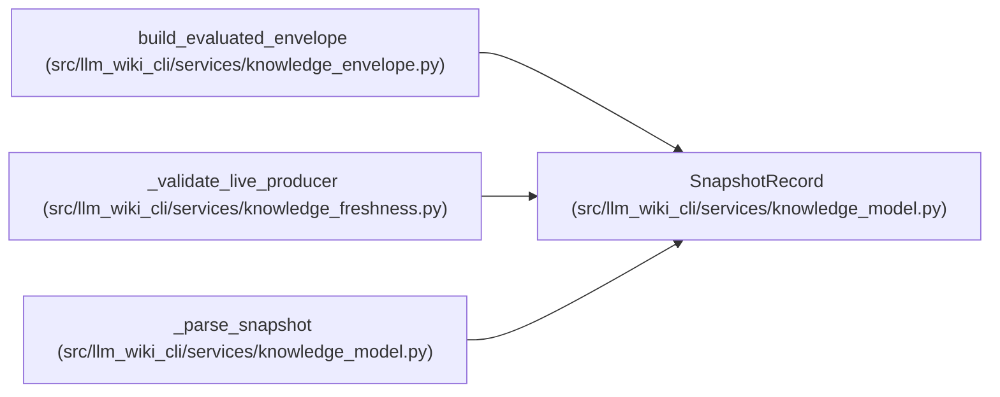

# SnapshotRecord

**Location:** `src/llm_wiki_cli/services/knowledge_model.py:293`
**Kind:** Class
**Bases:** —
**Module:** [knowledge_model](../modules/knowledge_model.md)

**Decorators:** `@dataclass(frozen=True)`

## Description

_Auto-generated from `SnapshotRecord` in `src/llm_wiki_cli/services/knowledge_model.py`._

## Attributes

| Name | Type | Default | Description |
|------|------|---------|-------------|
| `source_snapshot_hash` | `str` | *required* | — |
| `markdown_snapshot_hash` | `str` | *required* | — |
| `surface_index_hash` | `str` | *required* | — |
| `generation_options_hash` | `str` | *required* | — |
| `extensions` | `Extensions` | `field(default_factory=dict)` | — |

## Methods

*No public methods. Inherits from base classes.*

## Relationships

<!-- Auto-generated relationship summary. Do not edit by hand. -->

### Summary

| Module | Methods | Attributes |
|---|---:|---|
| [knowledge_model](../modules/knowledge_model.md) | 0 | `extensions`, `generation_options_hash`, `markdown_snapshot_hash`, `source_snapshot_hash`, `surface_index_hash` |

### References

| Reference | Kind | Source | Call sites |
|---|---|---|---:|
| `build_evaluated_envelope` | call | [knowledge_envelope](../modules/knowledge_envelope.md) | 1 |
| `_validate_live_producer` | call | [knowledge_freshness](../modules/knowledge_freshness.md) | 1 |
| `_parse_snapshot` | call | [knowledge_model](../modules/knowledge_model.md) | 1 |
| `_parse_snapshot` | type_reference | [knowledge_model](../modules/knowledge_model.md) | — |
