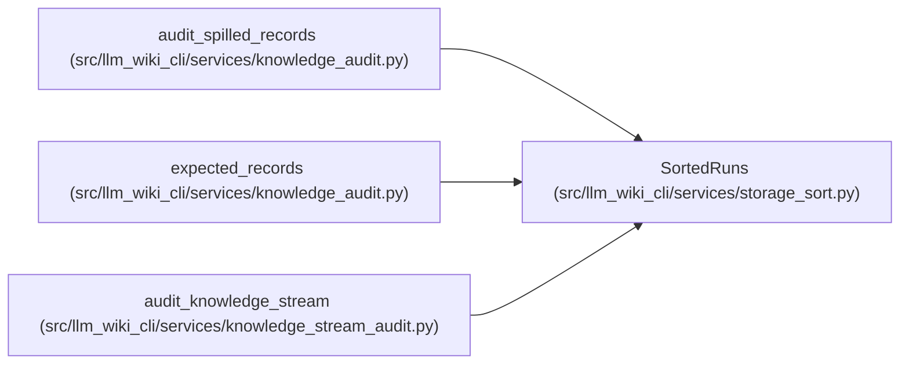

# SortedRuns

**Location:** `src/llm_wiki_cli/services/storage_sort.py:14`
**Kind:** Class
**Bases:** —
**Module:** [storage_sort](../modules/storage_sort.md)

## Description

Spills ordered audit records into bounded batches, then merges them with at most 32 input handles. Record and cumulative write quotas are explicit. Closing the owner also closes suspended readers before removing private runs.

## Attributes

*No annotated attributes found.*

## Methods

| Method | Signature | Decorators | Description |
|--------|-----------|------------|-------------|
| `__init__` | `(key = lambda row: row, *, batch_bytes = 1048576, record_bytes = 1048576, disk_bytes = 2147483648)` | — | — |
| `_path` | `()` | — | — |
| `_write` | `(stream, raw)` | — | — |
| `add` | `(row)` | — | — |
| `_flush` | `()` | — | — |
| `_lines` | `(stream)` | — | — |
| `_merge` | `(paths)` | — | — |
| `seal` | `()` | — | — |
| `__iter__` | `()` | — | — |
| `close` | `()` | — | — |
| `__enter__` | `()` | — | — |
| `__exit__` | `(*exc)` | — | — |

## Relationships

<!-- Auto-generated relationship summary. Do not edit by hand. -->

### Summary

| Module | Methods | Attributes |
|---|---:|---|
| [storage_sort](../modules/storage_sort.md) | 12 | — |

### References

| Reference | Kind | Source | Call sites |
|---|---|---|---:|
| `audit_spilled_records` | call | [knowledge_audit](../modules/knowledge_audit.md) | 2 |
| `expected_records` | call | [knowledge_audit](../modules/knowledge_audit.md) | 1 |
| `audit_knowledge_stream` | call | [knowledge_stream_audit](../modules/knowledge_stream_audit.md) | 1 |
