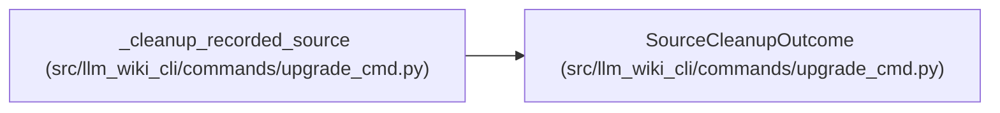

# SourceCleanupOutcome

**Location:** `src/llm_wiki_cli/commands/upgrade_cmd.py:126`
**Kind:** Class
**Bases:** —
**Module:** [upgrade_cmd](../modules/upgrade_cmd.md)

**Decorators:** `@dataclass(frozen=True)`

## Description

Result of one recorded-source cleanup transaction.

## Attributes

| Name | Type | Default | Description |
|------|------|---------|-------------|
| `complete` | `bool` | *required* | — |
| `authority_changed` | `bool` | `False` | — |

## Methods

*No public methods. Inherits from base classes.*

## Relationships

<!-- Auto-generated relationship summary. Do not edit by hand. -->

### Summary

| Module | Methods | Attributes |
|---|---:|---|
| [upgrade_cmd](../modules/upgrade_cmd.md) | 0 | `authority_changed`, `complete` |

### References

| Reference | Kind | Source |
|---|---|---|
| `_cleanup_recorded_source` | call | [upgrade_cmd](../modules/upgrade_cmd.md) |
| `_cleanup_recorded_source` | call | [upgrade_cmd](../modules/upgrade_cmd.md) |
| `_cleanup_recorded_source` | call | [upgrade_cmd](../modules/upgrade_cmd.md) |
| `_cleanup_recorded_source` | call | [upgrade_cmd](../modules/upgrade_cmd.md) |
| `_cleanup_recorded_source` | call | [upgrade_cmd](../modules/upgrade_cmd.md) |
| `_cleanup_recorded_source` | call | [upgrade_cmd](../modules/upgrade_cmd.md) |
| `_cleanup_recorded_source` | call | [upgrade_cmd](../modules/upgrade_cmd.md) |
| `_cleanup_recorded_source` | call | [upgrade_cmd](../modules/upgrade_cmd.md) |
| `_cleanup_recorded_source` | type_reference | [upgrade_cmd](../modules/upgrade_cmd.md) |
