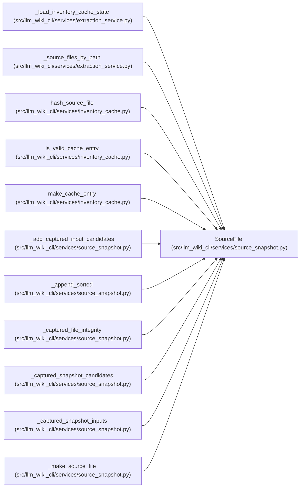

# SourceFile

**Location:** `src/llm_wiki_cli/services/source_snapshot.py:102`
**Kind:** Class
**Bases:** —
**Module:** [source_snapshot](../modules/source_snapshot.md)

**Decorators:** `@dataclass(frozen=True)`

## Description

A source-tree file discovered relative to a snapshot root.

## Attributes

| Name | Type | Default | Description |
|------|------|---------|-------------|
| `rel_path` | `str` | *required* | — |
| `abs_path` | `Path` | *required* | — |
| `suffix` | `str` | *required* | — |
| `language` | `str \| None` | *required* | — |
| `size` | `int` | *required* | — |
| `mtime_ns` | `int` | *required* | — |

## Methods

*No public methods. Inherits from base classes.*

## Relationships

<!-- Auto-generated relationship summary. Do not edit by hand. -->

### Summary

| Module | Methods | Attributes |
|---|---:|---|
| [source_snapshot](../modules/source_snapshot.md) | 0 | `abs_path`, `language`, `mtime_ns`, `rel_path`, `size`, `suffix` |

### References

| Reference | Kind | Source | Call sites |
|---|---|---|---:|
| `_load_inventory_cache_state` | type_reference | [extraction_service](../modules/extraction_service.md) | — |
| `_source_files_by_path` | type_reference | [extraction_service](../modules/extraction_service.md) | — |
| `hash_source_file` | type_reference | [inventory_cache](../modules/inventory_cache.md) | — |
| `is_valid_cache_entry` | type_reference | [inventory_cache](../modules/inventory_cache.md) | — |
| `make_cache_entry` | type_reference | [inventory_cache](../modules/inventory_cache.md) | — |
| `_add_captured_input_candidates` | type_reference | [source_snapshot](../modules/source_snapshot.md) | — |
| `_append_sorted` | type_reference | [source_snapshot](../modules/source_snapshot.md) | — |
| `_captured_file_integrity` | type_reference | [source_snapshot](../modules/source_snapshot.md) | — |
| `_captured_snapshot_candidates` | type_reference | [source_snapshot](../modules/source_snapshot.md) | — |
| `_captured_snapshot_inputs` | type_reference | [source_snapshot](../modules/source_snapshot.md) | — |
| `_make_source_file` | call | [source_snapshot](../modules/source_snapshot.md) | 1 |
| `_make_source_file` | type_reference | [source_snapshot](../modules/source_snapshot.md) | — |

> References: showing 12 of 14 logical references; 2 omitted by the 12-row generated summary limit.
