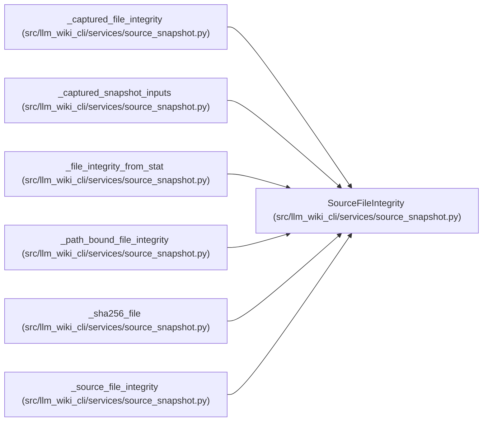

# SourceFileIntegrity

**Location:** `src/llm_wiki_cli/services/source_snapshot.py:128`
**Kind:** Class
**Bases:** —
**Module:** [source_snapshot](../modules/source_snapshot.md)

**Decorators:** `@dataclass(frozen=True)`

## Description

Filesystem identity used for cheap between-stage mutation checks.

## Attributes

| Name | Type | Default | Description |
|------|------|---------|-------------|
| `device` | `int` | *required* | — |
| `inode` | `int` | *required* | — |
| `mode_type` | `int` | *required* | — |
| `size` | `int` | *required* | — |
| `mtime_ns` | `int` | *required* | — |
| `ctime_ns` | `int` | *required* | — |

## Methods

*No public methods. Inherits from base classes.*

## Relationships

<!-- Auto-generated relationship summary. Do not edit by hand. -->

### Summary

| Module | Methods | Attributes |
|---|---:|---|
| [source_snapshot](../modules/source_snapshot.md) | 0 | `ctime_ns`, `device`, `inode`, `mode_type`, `mtime_ns`, `size` |

### References

| Reference | Kind | Source | Call sites |
|---|---|---|---:|
| `_captured_file_integrity` | type_reference | [source_snapshot](../modules/source_snapshot.md) | — |
| `_captured_snapshot_inputs` | type_reference | [source_snapshot](../modules/source_snapshot.md) | — |
| `_file_integrity_from_stat` | call | [source_snapshot](../modules/source_snapshot.md) | 1 |
| `_file_integrity_from_stat` | type_reference | [source_snapshot](../modules/source_snapshot.md) | — |
| `_path_bound_file_integrity` | type_reference | [source_snapshot](../modules/source_snapshot.md) | — |
| `_sha256_file` | type_reference | [source_snapshot](../modules/source_snapshot.md) | — |
| `_source_file_integrity` | type_reference | [source_snapshot](../modules/source_snapshot.md) | — |
